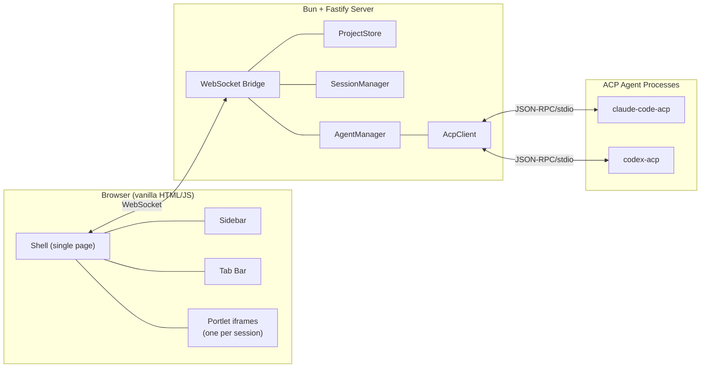
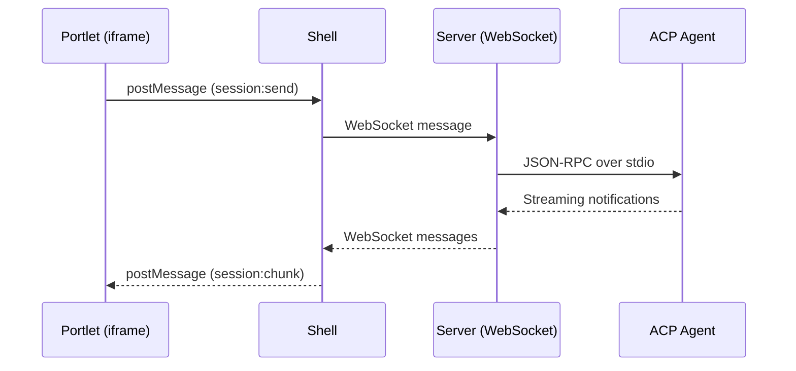

# Liminal Builder

An agentic IDE that replaces the friction of juggling CLI terminals with an organized, session-based interface for parallel AI-assisted development. Move between projects and agent conversations fluidly — no more lost terminal windows, no more "which tab was that Codex session in?"

## What It Does

Liminal Builder wraps AI coding CLIs (Claude Code, Codex) via the [Agent Control Protocol (ACP)](https://github.com/anthropics/claude-code/tree/main/packages/agent-control-protocol) and provides:

- **Project sidebar** — Add project directories, browse agent sessions grouped by project, collapse/expand folders
- **Chat interface** — Send messages, stream responses, see tool calls and thinking blocks inline with status indicators
- **Tab management** — Multiple sessions open simultaneously, instant switching (content stays alive in background iframes), drag-to-reorder
- **Multi-CLI support** — Claude Code and Codex sessions side by side, same interface
- **Session persistence** — Sessions survive app restart; conversation history loads from ACP agents on demand

## Architecture



**Shell/portlet model:** The shell manages the sidebar, tab bar, and a single WebSocket connection. Each open session is an iframe (portlet) that receives messages from the shell via `postMessage`. This gives natural DOM isolation, trivial scroll preservation on tab switch, and independent rendering per session.

### Data Flow



## Stack

| Layer | Technology |
|-------|------------|
| Runtime | [Bun](https://bun.sh) |
| Server | [Fastify](https://fastify.dev) with `@fastify/websocket` and `@fastify/static` |
| Client | Vanilla HTML/JS (no framework) |
| Agent protocol | ACP over JSON-RPC/stdio |
| Markdown | [marked](https://marked.js.org) + [DOMPurify](https://github.com/cure53/DOMPurify) + [highlight.js](https://highlightjs.org) |
| Storage | JSON files (`~/.liminal-builder/`) + browser localStorage |
| Testing | Bun test runner + jsdom for client tests |

## Documentation

| Document | Description |
|----------|-------------|
| [`docs/prd.md`](docs/prd.md) | Product Requirements Document |
| [`docs/feature-spec-mvp.md`](docs/feature-spec-mvp.md) | Feature Specification — flows, acceptance criteria, test conditions, data contracts |
| [`docs/tech-design-mvp.md`](docs/tech-design-mvp.md) | Technical Design — architecture, interfaces, test mappings, story breakdown |

Built using [Liminal Spec](https://github.com/anthropics/claude-code) — a spec-driven development methodology with full traceability from requirements through tests to code.

## Development

```bash
# Install dependencies
bun install

# Start development server
bun run dev

# Run tests
bun test
```

## Future Direction

Post-MVP plans include a context management kernel (compression, memory graphs, session swapping), additional CLI support (Gemini, Cursor, Copilot), a project console/terminal panel, and potential migration from JSON file storage to a proper database backend. See [`docs/future/`](docs/future/) for braindump notes.

## License

TBD
