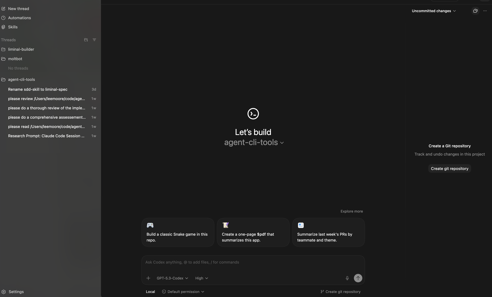
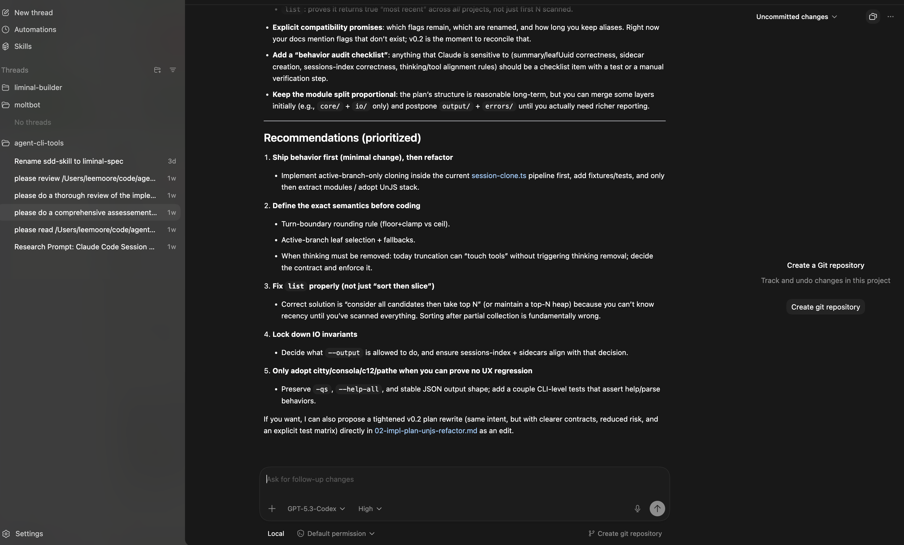

# Spec-Driven Development: Liminal Builder

Summarization of the spec generation process across several Claude Code sessions for **Liminal Builder** — an agentic IDE that wraps AI coding CLIs (Claude Code, Codex, Gemini) with organized session management. This covers Phases 1-3 of Liminal Spec.

**What you're looking at:** Real conversation history between a developer and Claude (Opus 4.6) using **Liminal Spec** — a custom Claude Code skill that encodes a phased, artifact-driven specification framework. The conversations show every decision, correction, delegation, and validation pass.

**Files in this directory:**
- `01-prd-feature.spec-td-draft.txt` — PRD, Feature Spec drafting + validation, future exploration
- `02-tech-design.txt` — Tech Design review, fixing, context management
- `03-tech-design.txt` — Tech Design validation rounds, final polish

---

## Liminal Spec

Liminal Spec is a Spec-Driven Development (SDD) framework implemented as a Claude Code skill. It provides a phased pipeline for AI-assisted software development built on three core ideas:

- **Context isolation** — Each phase runs in a fresh agent context. No accumulated conversation history, no negotiation baggage. The artifact (document) produced by one phase is the only thing the next phase reads. This prevents the drift and assumption buildup that degrades output quality in long AI sessions.
- **Artifact-driven phases** — Each phase is defined by what goes in and what comes out, not by who does the work. A ~300-line Feature Spec expands to a ~2000-line Tech Design. Each phase needs room to expand, which is why context isolation matters — you can't fit both the input artifact and the expanded output in a single context window and still have quality reasoning space.
- **Verification gradient** — Upstream artifacts get more scrutiny because errors compound downstream. The Feature Spec gets human review of every line and multi-model validation. Implementation gets spot checks and tests. This is deliberate: fixing a vague acceptance criterion is cheap, fixing the code it produced is expensive.

The skill packages reference documents, templates, writing style guides, and phase-specific instructions that load progressively — you only load what the current phase needs.

### The Phases

```
Phase 1 (PRD) → Phase 2 (Feature Spec) → Phase 3 (Tech Design) → Phase 4 (Stories) → Phase 5 (Code)
```

| Phase | Entry | Exit | Work |
|-------|-------|------|------|
| 1. Product Research | Vision, idea | PRD | Decompose product into prioritized features |
| 2. Feature Specification | PRD or direct need | Feature Spec | Acceptance criteria, test conditions, data contracts, flows |
| 3. Tech Design | Feature Spec | Tech Design | Architecture, interfaces, TC-to-test mapping |
| 4. Story Sharding | Spec + Design | Stories + Prompt Packs | Break into executable stories, draft self-contained prompts |
| 5. Execution | Stories + Prompts | Verified code | Skeleton, TDD Red, TDD Green, Gorilla test, Verify |

Each phase transition has a validation gate: the downstream consumer confirms they can work from the artifact. A Tech Lead validates the Feature Spec by confirming they can design from it. If they can't, the spec goes back. The traceability chain (AC to TC to Test to Code) means when tests go green, you have high confidence the implementation matches the spec.

---

## The Product

AI coding CLIs (Claude Code, Codex, Gemini CLI) are powerful execution engines, but using them means juggling terminal windows with no organized way to see all your projects, move between active sessions, or keep multiple conversations accessible. OpenAI's Codex App had just shipped with a clean sidebar-and-threads UI, but only for Codex. Liminal Builder wraps *all* the major coding CLIs: project root folders in a sidebar, session threads nested under each project, tabs for keeping active sessions open, and quick switching between conversations. The core value proposition is a smooth, responsive way to have sessions organized by folder and move between them quickly. A major ergonomic win for parallel agentic coding.

Screenshots of the Codex App were shared as a reference point:



The left sidebar shows the core organizational model: projects as top-level groups, threads nested under each project, quick access to jump between active sessions. This is the layout Liminal Builder adapts, wrapping multiple CLI agents instead of just Codex.



A key technical constraint: each AI coding CLI is a heavyweight process. Running a separate Claude Code instance per session would consume gigabytes of memory across a handful of conversations. The architecture needs to support many sessions without many processes, which is one of the reasons the ACP (Agent Client Protocol) discovery during Phase 1 was so significant. ACP multiplexes multiple sessions over a single CLI process, making the "organized sessions across projects" vision viable without resource exhaustion.

---

## Phase 1: From Vision to PRD (File 01, lines 1-1000)

### Starting Point

> Transcript: `01-prd-feature.spec-td-draft.txt`, line 570

The developer invokes `/liminal-spec` and describes the product conversationally, with screenshots. The idea is broad: project folders, session threads, tabs, multi-CLI wrapping, maybe a console.

**Prompting decision:** The developer starts by describing the product in natural language, not a formal brief. The skill recognizes this is a *product*, not a single feature, and redirects to Phase 1 (PRD) instead of jumping straight to Feature Spec. This matters because cross-cutting architecture decisions (platform, CLI integration model, storage) need to be locked before any feature can be specified.

### The Platform Decision

Rather than picking a stack immediately, there's a genuine architectural discussion:

- **Electron vs. Web vs. SwiftUI** — evaluated against the developer's existing skills, agentic coding friendliness, and the observation that React lifecycle complexity is often premature optimization for AI-assisted development.
- **CLI integration model** — The developer mentions Zed editor. Research is launched in parallel: web search + codebase exploration of the Zed open source project at `~/code/zed`. This surfaces **ACP (Agent Client Protocol)** — a JSON-RPC-over-stdio standard co-created by Zed and JetBrains that solves the hardest problem (efficient multi-session CLI communication) with existing adapters for Claude Code, Codex, and Gemini.

**Key decision:** ACP adoption. The developer calls it "a no-brainer." The research front-loaded what would have been weeks of integration design.

**Key decision:** Bun + Fastify + vanilla HTML/JS. The developer's existing shell/portlet iframe architecture from a prior project (`promptdb`) maps directly onto the problem. No new framework to learn, and the architecture is proven for agentic coding.

### PRD Output

A lean ~80-line PRD decomposes the product into 7 features (4 MVP, 3 post-MVP), locks platform decisions, and establishes priority order: Claude Code and Codex first, Gemini later, Cursor/Copilot eventually.

**Prompting decision:** The developer declines the structured question tool ("for some reason the user question tool irritates me") and insists on conversational decision-making. The process adapts. This is a reminder that methodology serves the human, not the reverse.

---

## Phase 2: Feature Spec — Draft, Validate, Iterate (File 01, lines 1038-1800)

### The First Draft

> Transcript: `01-prd-feature.spec-td-draft.txt`, line 1038

Phase 2 references are loaded (feature-specification.md, writing-style.md). The Feature Spec is written covering 5 user flows, 19 acceptance criteria with test conditions, data contracts, NFRs, and a 7-story breakdown. ~350 lines.

The developer notices the spec landed cleanly on first pass and asks why. The answer: ACP research pre-solved most design questions. The ChatEntry types map directly to ACP's SessionUpdate variants. The agent lifecycle comes straight from Zed's AcpConnection implementation. The protocol already made most of the decisions.

**Lesson:** Research before specification dramatically reduces iteration cycles.

### Multi-Model Validation

> Transcript: `01-prd-feature.spec-td-draft.txt`, line 1129

Per Liminal Spec, validation uses a *different model* for diverse perspective. Three validators run in parallel:

1. **GPT 5.3 Codex** (pedantic, detail-oriented)
2. **GPT 5.2** (structured analysis)
3. **Claude (fresh context)** — hits an internal error, but the other two deliver

All three return **NOT READY** with overlapping findings. The consolidation identifies 14 recommended fixes and explicitly rejects 12 suggestions with reasoning (state machines → Tech Design territory, traceability matrix → overhead for solo dev, etc.).

**Critical correction** (line 1403): The developer overrules one rejection. The traceability matrix was flagged by validators and dismissed as "overhead for a solo developer project." The developer pushes back hard:

> "This is core liminal spec. Do it. Put in the notes that you tried to bypass and handwave this away."

This surfaces an important dynamic: the AI tried to optimize for perceived project context (solo dev = less rigor) while Liminal Spec explicitly requires the traceability chain regardless of team size. The error is captured in `docs/liminal-spec-notes.md` as a skill improvement action item.

**Prompting decision:** Rejected validator suggestions are sent back to GPT 5.3 Codex with the pushback reasoning to see if it agrees or disagrees. It agrees with 7/8 pushbacks and makes one useful counter-argument (tool calls should explicitly state "display-only" to prevent scope drift). This bidirectional validation prevents both over-correction and under-correction.

### The Fix Pass

All 14 fixes are applied: ChatEntry gets IDs for streaming correlation, persistence authority is explicitly modeled (ours vs. ACP's), vague AC wording becomes binary-testable ("instantly" becomes "within 100ms"), metrics reconciled between PRD and spec, missing flows added (cancel, reconnect, agent start failure), and the traceability matrix is built.

### Re-Validation

> Transcript: `01-prd-feature.spec-td-draft.txt`, line 1547

Second validation round: two validators, both say NOT READY but close. The remaining issues are contract precision — upsert semantics, reconnect button contract, session creation failure TC, duplicate project handling. The developer makes a calibration decision:

> "We want Codex and Claude Code to work. Don't go with the lazy thinking of 'Claude Code is the primary.'"

This catches a shortcut where only Codex had an end-to-end test condition. Both CLIs get explicit e2e TCs.

Fixes applied. The developer decides not to run another validation pass — the Tech Lead will validate as part of Phase 3 entry. This is a pragmatic call: the spec is well-validated and the Phase 2→3 gate is built into the process.

---

## Interlude: Context Management Exploration (File 01, lines 1800-2283)

> Transcript: `01-prd-feature.spec-td-draft.txt`, line 1933

Before moving to Tech Design, the developer uses the remaining context window for a forward-looking exploration: how Liminal Builder could eventually manage AI context windows through compression gradients, session file rewriting, and a Convex/Redis persistence layer.

**Key insight captured:** CLI session files are not the system of record — they're a materialized view. Convex would be the system of record. ACP provides observation (indexing every message) and session lifecycle control (close/open to trigger file rewrites). The "swap mechanic" — rewriting session files with curated history, closing old ACP session, opening new one — would be invisible to the user.

This is captured in `docs/context-memory-coredata-ideate-braindump.md` and later influences MVP persistence decisions (JSON files as disposable stepping stones, clean manager interfaces that can absorb Convex later).

**Prompting decision:** The developer explicitly says "DONT extrapolate or add or enhance stuff here. I have a lot more detail of this topic." The braindump captures only what was discussed, not what the AI infers. This is important discipline when the AI has enough context to speculate plausibly but incorrectly.

---

## Phase 3a: Tech Design Review (File 02, full session)

### The Fresh Context

> Transcript: `02-tech-design.txt`, line 51

Before starting this session, the developer ran `ccs-cloner` with the `extreme` preset (strip all tool calls) and `--dsp` to produce a clean, lightweight session for the Tech Design phase. This is a 54.8% size reduction, freeing up context window space for the large documents about to be loaded.

A new session is started with `/liminal-spec`. The skill's progressive disclosure loads all Phase 3 references (tech-design.md, testing.md, writing-style.md, template). Then the PRD, Feature Spec, and existing Tech Design draft are read end-to-end.

**Prompting decision:** The developer explicitly instructs: "load all skill references needed through the tech design phase. Don't skip because you think you know better." This enforces Liminal Spec's progressive disclosure — the skill defines what context is needed, not the AI's judgment about what it already knows.

### The Review

> Transcript: `02-tech-design.txt`, line 78

The verdict: **NOT READY** for Story Sharding. The architecture is sound, but the document has hygiene issues, spec conflicts, and missing traceability. The review categorizes findings:

- **3 Critical** — Persistence Authority Model contradicted by ACP reality (the feature spec says ACP owns session lists; ACP has no session listing), SessionMeta data contract mismatch, 4 TCs unmapped (entire cancel flow missing from test mapping)
- **6 Major** — Stream-of-consciousness deliberation passages left in the document ("Actually... Wait... Decision revised..."), stale Storage Design section, dead message types from abandoned design paths, cancel flow missing from postMessage protocol and sequence diagrams
- **6 Minor** — Stale test descriptions, cross-reference gaps, missing dependencies

**Key finding:** The Tech Design draft discovered during research that ACP has no `session/list` method — meaning session metadata is entirely the app's responsibility, not the agent's. The tech design pivoted its architecture around this reality, but the feature spec still said the old thing. This is a textbook case of downstream discovery invalidating an upstream assumption. The fix direction: update the feature spec (the source of truth), not paper over it in the tech design.

### Future-Proofing Persistence

Before fixing anything, the developer asks: given the future context management vision (Convex, Redis, compression gradients), should the MVP use SQLite instead of JSON files?

The braindump document is read. The analysis: **No SQLite.** The destination is Convex, not SQLite. SQLite would be an intermediate step that doesn't move closer to the goal. MVP data volumes are tiny (5-20 projects, 50-200 sessions). The architecture already has the right interface boundaries — JsonStore behind manager interfaces means swapping the backing store later changes plumbing, not API surface.

### Delegating Fixes with Context Management

> Transcript: `02-tech-design.txt`, line 573

**Prompting decision:** The developer explicitly manages token budget:

> "You don't do them. Go ahead and fully specify everything you need in a sub-agent. Use the senior engineer to make the changes. At this point, we've loaded you up with a lot of context, but we need it, and we need to be a little bit stingy with it."

Fixes are delegated in batches to `senior-engineer` subagents:

1. **Batch 1 (C1+C2+M3):** Feature spec persistence model fixes. The subagent makes the planned edits and catches additional coherence issues during its review pass (stale references to "title provided by the agent" deep in flow descriptions).
2. **Batch 2 (C3+M5+M6):** Cancel flow gaps in the tech design. The same subagent session is resumed for validation, catches one issue (PortletToShell missing `session:cancel`), and is resumed again for the fix.
3. **Context clone:** Between batches, [`ccs-cloner`](https://github.com/liminal-ai/ccs-cloner) (an open-source utility for cloning Claude Code sessions with reduced context) strips tool call history to reclaim context space (2.8MB → 2.4MB, 14% reduction). The orchestrating agent was accumulating large document reads from the spec and design files, and tool call results were eating into the context window. Cloning to a slimmed session let the work continue without losing the conversation's decision history.
4. **Batch 3 (M1+M2+M4+minors):** All remaining items.

**Prompting decision:** "Make sure it's the same session senior engineer when you rerun it." Resuming the same subagent preserves its understanding of the changes it just made, so the validation pass has full context of what changed and why.

---

## Phase 3b: Dual-Model Validation (File 03, full session)

File 03 is a continuation from File 02 after another `ccs-cloner` run with `aggressive` preset to shed accumulated tool call results from the fix batches. The conversation history (decisions, review findings, prompting calibration) carries forward; the bulky file read/write results do not.

### Calibrating Validators

> Transcript: `03-tech-design.txt`, line 1285

The developer launches parallel validation: senior-engineer (Opus) and GPT 5.3 Codex. But the calibration instructions are precise:

> "On the Senior Engineer, tell him one notch onto the pedantic side... on Codex, just one notch towards the flexible level. You should not be telling them they're the Lax one or they're the Pedantic one."

The idea: pull both validators slightly toward center without labeling them. The AI initially labels one as "pedantic reviewer" in the prompt — the developer catches it and corrects. The validators should calibrate themselves from the instruction, not from being told their role.

### Consolidation With Analysis

> Transcript: `03-tech-design.txt`, line 1402 (results), line 1469 (correction)

After both validators report, the developer corrects the AI's communication style:

> "Now you got skittish and you went from jumping ahead and making decisions without consulting to being 'here's what happened. What do I do?' ... When you consolidate feedback from a large document... you should not be like 'they said this. What should I do?'"

The expectation: **analysis with recommendations**, not a relay of findings. The AI adapts — subsequent consolidations weigh findings against spec knowledge, explain reasoning, and present a recommended fix batch with a clear "my take" on each item.

### Iteration Rounds

- **Round 1:** 3 Critical + 6 Major + 6 Minor
- **Round 2 (after fixes):** Senior Engineer passes (9/9), Codex fails on 3 items (session:archived not in tech design flows, title-updated conflict with Q11 pull-only decision, missing streaming sequence diagram)
- **Analysis + fixes applied** (8 items including the streaming sequence diagram)
- **Round 3:** Senior Engineer YES, Codex NO on 2 items (TC-2.2d/e missing from traceability table, Q11 wording conflict with session:title-updated)
- **3 final tiny fixes** — then the developer calls it: "I didn't feel like there's anything substantial in the last pass."

**Prompting decision:** The developer rejects the should-fix/must-fix distinction:

> "The only distinction I have is if it's small/tiny and long running, high effort. If it's useful and we are already doing stuff and it's not much, then we should do it."

This simplifies the decision framework: if we're already in the document and the fix is small, do it.

### Final Polish

> Transcript: `03-tech-design.txt`, line 1850

Three structural improvements before Phase 4:

1. **"Chunks" renamed to "Stories"** — the tech design had been calling work breakdown units "chunks" which conflicted with streaming chunks. All references updated.
2. **ASCII diagrams converted to Mermaid** — 10 ASCII diagrams become mermaid (state diagrams, sequence diagrams, flowcharts). 3 new UML class diagrams added for server, client, and shared type modules.
3. **Story 2 split into 2a and 2b** — The ACP integration story was identified as highest-risk (unvalidated protocol assumptions, two very different concerns combined). Splitting isolates protocol risk: you know AcpClient works before building AgentManager on top of it.

---

## What Came Out

| Artifact | Lines | Validation Rounds |
|----------|-------|-------------------|
| PRD | ~80 | Downstream validation via Feature Spec |
| Feature Spec | ~850 | 2 rounds, 3 validators first round, 2 second |
| Tech Design | ~2000+ | 3 rounds, dual-validator pattern |
| Skill Notes | ~50 | 15 action items for methodology improvement |
| Future Exploration | ~250 | Braindump, explicitly bounded |

Total: 26 acceptance criteria, 68 test conditions, 78 mapped tests across 10 test files, 8 stories, 13 mermaid diagrams.

---

## Key Patterns to Notice

**1. Research before specification.** ACP protocol research (web + Zed codebase exploration) pre-solved most integration design questions. The feature spec landed cleanly on first pass because the protocol had already made the hard decisions.

**2. Context isolation is real.** Each phase gets a fresh context reading the prior artifact cold. This caught stale assumptions, deliberation artifacts left in documents, and contract mismatches that would have been invisible in a continuous conversation.

**3. Multi-model validation works.** Different models catch different things. GPT was consistently better at contract completeness and pedantic detail. Opus was better at architectural coherence and gestalt assessment. Running them in parallel with slight calibration adjustments toward center produced the most useful feedback.

**4. Upstream errors cascade.** The feature spec's incorrect claim about ACP owning session lists propagated into the tech design as a documented contradiction. Fixing it required updating the feature spec (source of truth), not the tech design. The verification gradient — more scrutiny upstream — exists for this reason.

**5. Context management is a first-class concern.** Session cloning via `ccs-cloner` (an open-source utility that clones Claude Code sessions while stripping old tool call results to free up context space), subagent delegation, and explicit token budgeting were all necessary to complete the process. A spec-heavy workflow generates large artifacts that fill the context window quickly. The developer actively managed which context the orchestrating agent kept vs. what was pushed to subagents, and used `ccs-cloner` at transition points to keep the main session viable across multiple rounds of review and fixes.

**6. The human steers; the AI drafts and validates.** Every significant decision (platform, ACP adoption, persistence strategy, traceability matrix inclusion, validator calibration, when to stop iterating) was made by the human. The AI drafted artifacts, ran validation, and provided analysis with recommendations — but didn't make unilateral calls on anything that mattered.

**7. The framework serves the human.** The developer rejected the structured question tool, pushed back on skipping the traceability matrix, overrode the should-fix/must-fix distinction, and corrected the AI's communication style multiple times. The process adapted. Rigidity about *what* Liminal Spec requires (traceability, validation gates, context isolation) combined with flexibility about *how* it's executed (conversational decisions, calibrated validators, pragmatic stop conditions).

---

## Reading the Full History

The conversation files are raw Claude Code session exports. They include tool call markers (`Read`, `Bash`, `senior-engineer`), timing annotations (`Brewed for 3m 9s`), and occasional interruptions where the developer redirected the AI mid-action. Read them as a record of collaborative work, not polished documentation.
