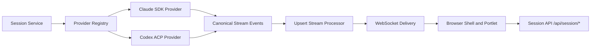
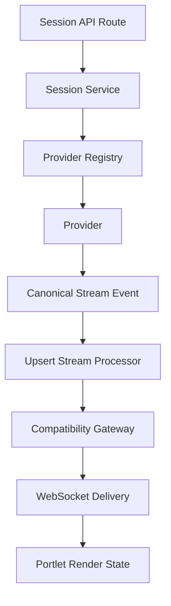
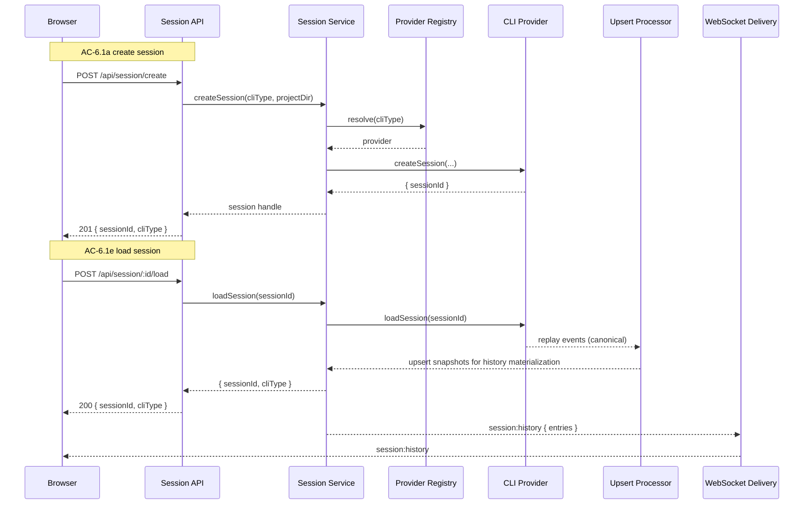
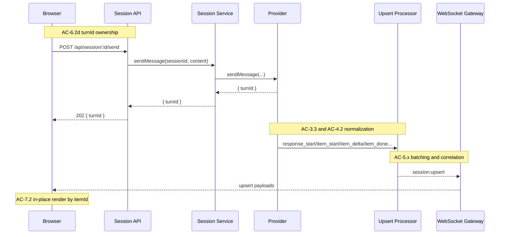
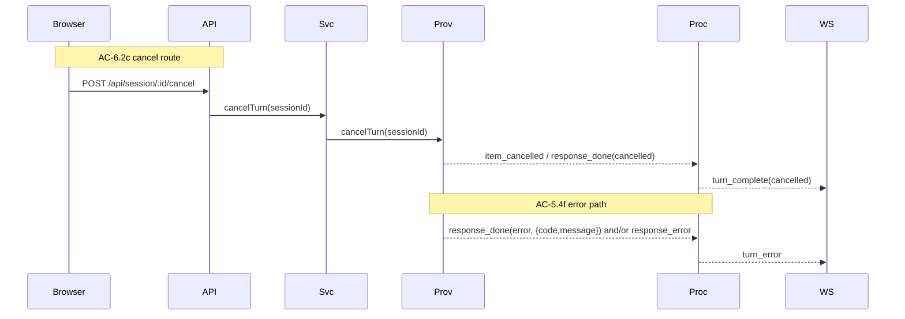
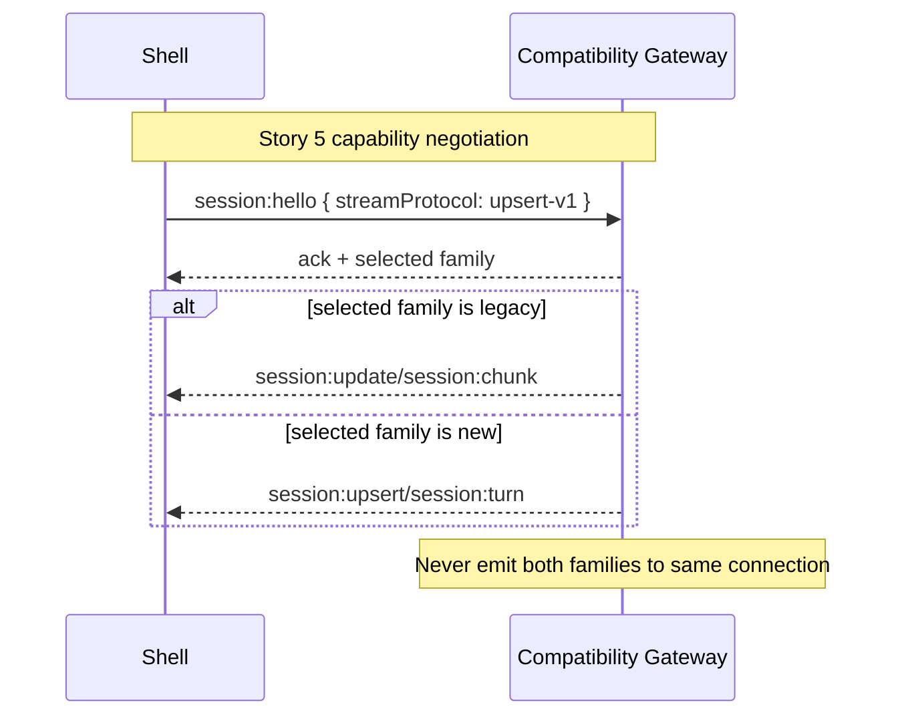
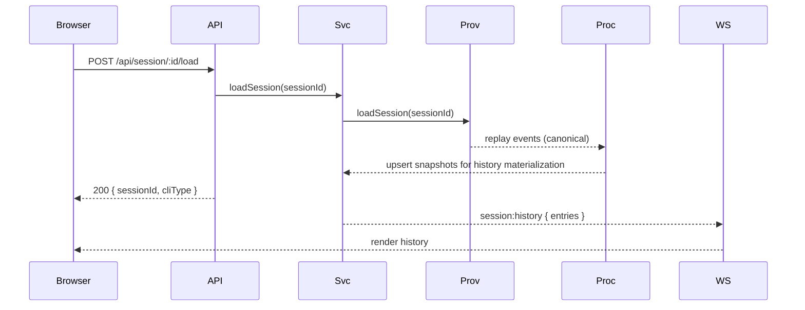

# Technical Design: Provider Architecture and Streaming Pipeline

## Purpose

This document translates the epic at `/Users/leemoore/liminal/apps/liminal-builder/docs/epics/02-provider-streaming-pipeline/feature-spec.md` into implementation architecture.

This design is split into two artifacts:

- Core design (this file): architecture, interfaces, lifecycle decisions, module boundaries, flow design, and chunk plan.
- Companion test plan: `/Users/leemoore/liminal/apps/liminal-builder/docs/epics/02-provider-streaming-pipeline/test-plan.md` with full TC to test traceability.

The split keeps architecture decisions readable while still preserving full confidence-chain coverage.

## Spec Validation

The epic is design-ready after revalidation. The prior ambiguity set was resolved in the epic:

- Explicit load route and loadSession external contract.
- Canonical turnId ownership contract.
- AC-6.4 sequencing clarity across Story 5 and Story 6.
- Deterministic default batch gradient.

This design keeps provenance mapping explicit at implementation boundaries:

- `StreamEventEnvelope.timestamp` is the provider/source event time.
- `UpsertObject.sourceTimestamp` is derived from that envelope timestamp.
- `UpsertObject.emittedAt` is processor emission time.

## Context

This work replaces the current ACP-centric streaming bridge with a provider architecture where each CLI has a purpose-built provider that emits one canonical event vocabulary. The business outcome is no user-visible behavior change, but materially improved architecture quality: Claude Code startup and reuse become stable, stream processing becomes deterministic, and the pipeline becomes ready for Redis fan-out and Context ingestion.

The current runtime shape is a Fastify server plus WebSocket bridge. Chat transport and translation logic are concentrated in `/Users/leemoore/liminal/apps/liminal-builder/server/websocket.ts` and `/Users/leemoore/liminal/apps/liminal-builder/server/acp/acp-client.ts`. That shape works for MVP but couples protocol-specific translation directly to transport. It also encodes behavior around `session:update` and `session:chunk` that cannot scale cleanly to multiple providers and downstream consumers.

The target shape introduces three explicit layers: provider normalization, upsert processing, and delivery. Provider code maps SDK/ACP-native signals into canonical stream events. The upsert processor owns accumulation, batching, correlation, and terminal behavior. Transport delivers upsert objects and turn events. This layering is what enables Phase 2 insertion of Redis without refactoring provider logic or browser rendering semantics.

The design also introduces an explicit Session API (`/api/session/*`) while preserving a temporary WebSocket compatibility window. During Story 5, legacy and new message families can coexist, but a single connection may only receive one family. Story 6 removes legacy streaming messages after rollout checks pass.

## Tech Design Questions: Decisions

All 11 questions from the epic are resolved here.

| Q | Question | Decision | Applied In |
|---|---|---|---|
| 1 | SDK dependency installation | Add `@anthropic-ai/claude-agent-sdk` as direct runtime dependency. Add `@anthropic-ai/sdk` for event typing parity (`RawMessageStreamEvent`) to prevent transitive type drift. | Story 0, provider package setup |
| 2 | Streaming input generator lifecycle | Generator/subprocess failures become `ProviderError` events, then canonical terminal error signaling (`response_error` preferred, `response_done(status: "error")` with structured `error` also supported), then processor `turn_error`. Provider marks session dead and `isAlive=false`. | Claude provider lifecycle and error model |
| 3 | Content block index tracking | Deterministic item IDs: `${turnId}:${messageOrdinal}:${blockIndex}`. This avoids collisions when multiple assistant messages occur in one turn. | Claude provider normalization |
| 4 | Session history on load | Use the same normalization path for live and replay events. History is materialized through the processor into `session:history`. No separate ad-hoc translation path. | loadSession flow |
| 5 | Compatibility-window rollout checks | Emit protocol-family metrics per connection, duplicate-prevention assertions, and error-rate dashboards. Remove legacy only after a clean window (0 legacy consumers in active rollout cohort for 7 days). | Story 5-6 migration gate |
| 6 | ACP code retention | Keep ACP protocol primitives needed by Codex provider, remove old ACP-to-WebSocket bridge logic (`createPromptBridgeMessages`, legacy normalization paths) once Story 6 completes. | Codex provider refactor + cleanup |
| 7 | Error propagation model | Introduce typed `ProviderError` hierarchy with stable codes (`SESSION_NOT_FOUND`, `PROCESS_CRASH`, `PROTOCOL_ERROR`, `UNSUPPORTED_CLI_TYPE`, etc.). | Provider interface and Session API |
| 8 | SDK integration test boundary | Service tests mock SDK `query()` output stream. Optional gated live tests run only with explicit env (`RUN_PROVIDER_LIVE_TESTS=1`). | Test strategy |
| 9 | Browser rendering compatibility | Story 5 uses thin transport adapter per connection capability. Story 6 removes adapter and legacy ChatEntry stream paths. | WebSocket compatibility design |
| 10 | Thinking tradeoff | Default to streaming-capable mode (no fixed `maxThinkingTokens`) for parity with reasoning events. Allow per-session override via provider options when budget control is required. | Claude provider session options |
| 11 | Session metadata persistence | Keep `~/.liminal-builder/sessions.json` in Phase 1. Context-owned persistence is deferred to Phase 2. | Session API/session service |

## High Altitude: System View

### System Context



### Entry Points

- HTTP control surface:
  - `POST /api/session/create`
  - `POST /api/session/:id/load`
  - `GET /api/session/list`
  - `GET /api/session/:id/status`
  - `POST /api/session/:id/send`
  - `POST /api/session/:id/cancel`
  - `POST /api/session/:id/kill`
- WebSocket streaming surface:
  - New family: `session:upsert`, `session:turn`, `session:history`
  - Legacy family (temporary): `session:update`, `session:chunk`, `session:complete`, `session:cancelled`

### External Contracts

#### Provider Boundary

- Input: CLI-native events (Claude Agent SDK stream events, Codex ACP notifications).
- Output: `StreamEventEnvelope` with stable envelope fields plus typed `payload`.
- Error boundary: `ProviderError` codes; no raw adapter errors cross module boundaries.

#### Processor Boundary

- Input: canonical stream events.
- Output:
  - `UpsertObject` emissions with full accumulated content.
  - `TurnEvent` lifecycle emissions.
- Defaults:
  - `batchGradientTokens: [10, 20, 40, 80, 120]`
  - `batchTimeoutMs: 1000`

#### Session API Boundary

- `sendMessage()` returns canonical `turnId` that must match all emitted events for that turn.
- `loadSession()` is explicit external contract and maps to provider `loadSession()`.
- `POST /api/session/:id/load` returns session handle metadata only; history is delivered through WebSocket `session:history`.

#### Connection Capability Negotiation Contract

Compatibility-family selection is an explicit contract.

- Client hello (optional during Story 5): `session:hello { streamProtocol: "upsert-v1" }`
- Server ack: `session:hello:ack { selectedFamily: "legacy" | "upsert-v1" }`
- Routing rule: one family per connection for the lifetime of that connection.

### Runtime Prerequisites

| Prerequisite | Where | Verification |
|---|---|---|
| Bun runtime | local, CI | `bun --version` |
| Node.js runtime | local, CI | `node --version` |
| `claude-code-acp` and `codex-acp` availability (for current adapter paths) | local | command invocable from shell |
| `@anthropic-ai/claude-agent-sdk` installed | project | lockfile + import compile |

## Medium Altitude: Module Architecture

### Target File Layout

```text
server/
  api/
    session/
      routes.ts                         # NEW
      session-service.ts                # NEW
  providers/
    provider-types.ts                   # NEW
    provider-errors.ts                  # NEW
    provider-registry.ts                # NEW
    claude/
      claude-sdk-provider.ts            # NEW
      claude-event-normalizer.ts        # NEW
    codex/
      codex-acp-provider.ts             # NEW
      codex-event-normalizer.ts         # NEW
  streaming/
    stream-event-schema.ts              # NEW
    upsert-types.ts                     # NEW
    upsert-stream-processor.ts          # NEW
  websocket/
    stream-delivery.ts                  # NEW
    compatibility-gateway.ts            # NEW
  websocket.ts                          # UPDATE (retain connection mgmt, remove legacy bridge logic)
  acp/
    acp-client.ts                       # UPDATE (Codex provider dependency only)
shared/
  stream-contracts.ts                   # NEW shared contracts for server/client typing
client/
  shell/
    shell.js                            # UPDATE (capability negotiation + upsert routing)
  portlet/
    portlet.js                          # UPDATE (upsert rendering path + compatibility mode)
tests/
  server/
    contracts/
    providers/
    streaming/
    api/
    pipeline/
    websocket/
  client/
    upsert/
  integration/
```

### Module Responsibility Matrix

| Module | Responsibility | Dependencies | AC Coverage |
|---|---|---|---|
| `stream-event-schema.ts` | Canonical stream contract and validation | Zod | AC-1.1, AC-1.2, AC-1.3 |
| `provider-types.ts` | Provider interface, send/load lifecycle signatures | stream contracts | AC-2.1 |
| `provider-registry.ts` | Provider lookup by cliType | provider implementations | AC-2.2 |
| `claude-sdk-provider.ts` | Claude session/process control and event normalization | SDK query stream | AC-3.x, AC-2.1 |
| `codex-acp-provider.ts` | Codex ACP adaptation behind provider contract | acp-client | AC-4.x, AC-2.1 |
| `upsert-stream-processor.ts` | Canonical event accumulation, batching, tool correlation | upsert types | AC-5.x |
| `session-service.ts` | Session lifecycle orchestration across providers | registry, processor, metadata store | AC-6.x |
| `routes.ts` | HTTP contract adapter for Session API | session-service | AC-6.x |
| `stream-delivery.ts` | Delivery of upserts/turn events to browser | websocket connection context | AC-7.1, AC-7.3 |
| `compatibility-gateway.ts` | One-family-per-connection routing and migration | delivery, feature flags | AC-6.4, AC-7.4 |
| `client/portlet/portlet.js` | Upsert object rendering and in-place replacement by itemId | ws payloads | AC-7.2 |

### Runtime Interaction



## Medium Altitude: Flow Design

### Flow 1: Create and Load Session

Covers AC-6.1, AC-2.2, AC-3.1, AC-4.1, AC-7.3.

Session lifecycle now has explicit create and load contracts at the HTTP layer. `create` instantiates new provider-backed state. `load` re-opens an existing session and replays history through the same normalization pipeline used for live events.



### Flow 2: Send Message and Stream Upserts

Covers AC-3.2, AC-3.3, AC-4.2, AC-5.x, AC-6.2, AC-7.1, AC-7.2.

This flow is the core functional weave of the epic. Session API returns the canonical `turnId`. Provider emits canonical events. Processor emits upserts. Browser renders by replacing current item state with latest upsert payload.



### Flow 3: Cancel, Kill, and Error Terminal Path

Covers AC-3.4, AC-5.4, AC-6.3.

Cancellation and fatal provider errors produce distinct terminal behavior. Cancelled turns emit `turn_complete` with cancelled status. Error turns emit `turn_error` and must never surface as `turn_complete` with error status. Providers may signal error terminal state through `response_error` and/or `response_done(status: "error", error)`.



### Flow 4: Compatibility Window and Legacy Removal

Covers AC-6.4, AC-7.4.

Compatibility is connection-scoped, never per-message fan-out to both families. Negotiation happens once per connection. If absent, legacy is default during Story 5. Story 6 removes legacy branch.



### Flow 5: Session History Replay Through Canonical Pipeline

Covers AC-7.3.

History replay reuses provider normalization and processor semantics so load behavior and live behavior remain consistent. This avoids drift and duplicate translation bugs.



## Low Altitude: Interface Definitions

### Provider Errors

```typescript
// server/providers/provider-errors.ts
export type ProviderErrorCode =
  | "UNSUPPORTED_CLI_TYPE"
  | "SESSION_NOT_FOUND"
  | "PROCESS_CRASH"
  | "PROTOCOL_ERROR"
  | "INVALID_STREAM_EVENT"
  | "INTERRUPT_FAILED"
  | "SESSION_CREATE_FAILED";

export class ProviderError extends Error {
  readonly code: ProviderErrorCode;
  readonly cause?: unknown;

  constructor(code: ProviderErrorCode, message: string, cause?: unknown) {
    super(message);
    this.name = "ProviderError";
    this.code = code;
    this.cause = cause;
  }
}
```

### Canonical Stream Contracts

Invariant decision: `item_start` events with `itemType: "function_call"` must include both `name` and `callId`. This is enforced at schema level (not only in tests) to keep tool lifecycle correlation strict.

Invocation argument completeness note: `item_start(function_call)` guarantees correlation metadata (`name`, `callId`) but does not guarantee finalized arguments. Argument completeness is authoritative at `item_done(function_call)`.

```typescript
// server/streaming/stream-event-schema.ts
import { z } from "zod";

export const streamEventPayloadSchema = z.discriminatedUnion("type", [
  z.object({ type: z.literal("response_start"), modelId: z.string(), providerId: z.string() }),
  z.object({
    type: z.literal("item_start"),
    itemId: z.string(),
    itemType: z.enum(["message", "reasoning", "function_call", "function_call_output"]),
    callId: z.string().optional(),
    name: z.string().optional(),
  }).superRefine((payload, ctx) => {
    if (payload.itemType === "function_call") {
      if (!payload.callId) {
        ctx.addIssue({ code: z.ZodIssueCode.custom, path: ["callId"], message: "callId is required for function_call item_start" });
      }
      if (!payload.name) {
        ctx.addIssue({ code: z.ZodIssueCode.custom, path: ["name"], message: "name is required for function_call item_start" });
      }
    }
  }),
  z.object({ type: z.literal("item_delta"), itemId: z.string(), deltaContent: z.string() }),
  z.object({ type: z.literal("item_done"), itemId: z.string(), finalItem: z.unknown() }),
  z.object({ type: z.literal("item_error"), itemId: z.string(), error: z.object({ code: z.string(), message: z.string() }) }),
  z.object({ type: z.literal("item_cancelled"), itemId: z.string(), reason: z.string().optional() }),
  z.object({
    type: z.literal("response_done"),
    status: z.enum(["completed", "cancelled", "error"]),
    finishReason: z.string().optional(),
    error: z.object({ code: z.string(), message: z.string() }).optional(),
    usage: z.unknown().optional(),
  }).superRefine((payload, ctx) => {
    if (payload.status === "error" && !payload.error) {
      ctx.addIssue({
        code: z.ZodIssueCode.custom,
        path: ["error"],
        message: "error is expected when response_done.status is error",
      });
    }
  }),
  z.object({ type: z.literal("response_error"), error: z.object({ code: z.string(), message: z.string() }) }),
]);

const streamEventTypeSchema = z.enum([
  "response_start",
  "item_start",
  "item_delta",
  "item_done",
  "item_error",
  "item_cancelled",
  "response_done",
  "response_error",
]);

export const streamEventEnvelopeSchema = z.object({
  eventId: z.string(),
  timestamp: z.string(),
  turnId: z.string(),
  sessionId: z.string(),
  type: streamEventTypeSchema,
  payload: streamEventPayloadSchema,
}).refine((event) => event.type === event.payload.type, {
  message: "Envelope type must match payload.type",
  path: ["type"],
});

export type StreamEventEnvelope = z.infer<typeof streamEventEnvelopeSchema>;
```

### Provider Interface and Registry

```typescript
// server/providers/provider-types.ts
import type { StreamEventEnvelope } from "../streaming/stream-event-schema";

export type CliType = "claude-code" | "codex";

export interface CreateSessionOptions {
  projectDir: string;
  providerOptions?: Record<string, unknown>;
}

export interface LoadSessionOptions {
  viewFilePath?: string;
}

export interface ProviderSession {
  sessionId: string;
  cliType: CliType;
}

export interface SendMessageResult {
  turnId: string;
}

export interface CliProvider {
  readonly cliType: CliType;
  createSession(options: CreateSessionOptions): Promise<ProviderSession>;
  loadSession(sessionId: string, options?: LoadSessionOptions): Promise<ProviderSession>;
  sendMessage(sessionId: string, message: string): Promise<SendMessageResult>;
  cancelTurn(sessionId: string): Promise<void>;
  killSession(sessionId: string): Promise<void>;
  isAlive(sessionId: string): boolean;
  onEvent(sessionId: string, callback: (event: StreamEventEnvelope) => void): void;
}

// server/providers/provider-registry.ts
export interface ProviderRegistry {
  register(provider: CliProvider): void;
  resolve(cliType: CliType): CliProvider;
}
```

### Upsert Processor Interface

```typescript
// server/streaming/upsert-stream-processor.ts
import type { StreamEventEnvelope } from "./stream-event-schema";
import type { UpsertObject, TurnEvent } from "./upsert-types";

export interface UpsertProcessorConfig {
  batchGradientTokens: readonly number[]; // default [10, 20, 40, 80, 120]
  batchTimeoutMs: number; // default 1000
}

export interface UpsertProcessor {
  process(event: StreamEventEnvelope): void;
  destroy(reason?: { code: string; message: string }): void;
}

export interface UpsertProcessorDeps {
  onUpsert: (upsert: UpsertObject) => void;
  onTurn: (event: TurnEvent) => void;
  now: () => string;
}
```

### Session Service and Routes

```typescript
// server/api/session/session-service.ts
type CliType = "claude-code" | "codex";
type SessionState = "open" | "loading" | "dead";

export interface SessionService {
  createSession(input: { cliType: CliType; projectDir: string }): Promise<{ sessionId: string; cliType: CliType }>;
  loadSession(input: { sessionId: string }): Promise<{ sessionId: string; cliType: CliType }>;
  listSessions(input: { projectId: string }): Promise<{ sessions: Array<{ sessionId: string; cliType: CliType; projectId: string; status: SessionState }> }>;
  getStatus(input: { sessionId: string }): Promise<{ sessionId: string; cliType: CliType; isAlive: boolean; state: SessionState }>;
  sendMessage(input: { sessionId: string; content: string }): Promise<{ turnId: string }>;
  cancelTurn(input: { sessionId: string }): Promise<void>;
  killSession(input: { sessionId: string }): Promise<void>;
}

// server/api/session/routes.ts
export async function registerSessionRoutes(app: FastifyInstance, deps: { sessionService: SessionService }): Promise<void>;
```

### Compatibility Gateway

```typescript
// server/websocket/compatibility-gateway.ts
export type StreamProtocolFamily = "legacy" | "upsert-v1";

export interface ConnectionCapabilities {
  streamProtocol?: "upsert-v1";
}

export interface ConnectionContext {
  connectionId: string;
  selectedFamily: StreamProtocolFamily;
}

export interface CompatibilityGateway {
  negotiate(connectionId: string, capabilities?: ConnectionCapabilities): ConnectionContext;
  deliver(context: ConnectionContext, payload: { upsert?: UpsertObject; turn?: TurnEvent; legacy?: ServerMessage }): void;
}
```

## Functional to Technical Traceability (Design Summary)

Detailed TC-to-test mapping is maintained in `/Users/leemoore/liminal/apps/liminal-builder/docs/epics/02-provider-streaming-pipeline/test-plan.md`.

At module level:

- AC-1.x -> `stream-event-schema.ts`, `upsert-types.ts`.
- AC-2.x -> `provider-types.ts`, `provider-registry.ts`.
- AC-3.x -> `claude-sdk-provider.ts` and normalizer.
- AC-4.x -> `codex-acp-provider.ts` and normalizer.
- AC-5.x -> `upsert-stream-processor.ts`.
- AC-6.x -> `session-service.ts`, `routes.ts`.
- AC-7.x -> `stream-delivery.ts`, `compatibility-gateway.ts`, client portlet updates.
- AC-8.x -> integration suites and manual verification.

## Testing Architecture

The test philosophy is service mocks at external boundaries:

- Mock SDK stream and ACP adapter boundaries.
- Exercise internal integration paths (`route -> service -> provider -> processor`) for real.
- Do not mock hooks/services/components that are part of system-under-test.

Mock boundaries:

- `@anthropic-ai/claude-agent-sdk` query stream: mocked in provider tests.
- ACP process protocol boundary: mocked in Codex provider and route tests.
- Filesystem and process APIs: mocked where not core behavior.

## Verification Scripts

Use existing project scripts as quality gates:

- `red-verify`: `bun run format:check && bun run lint && bun run lint:eslint && bun run test:eslint-plugin && bun run typecheck`
- `verify`: `bun run format:check && bun run lint && bun run lint:eslint && bun run test:eslint-plugin && bun run typecheck && bun run test`
- `green-verify`: `bun run verify && bun run guard:no-test-changes`
- `verify-all`: `bun run verify && bun run test:client && bun run test:integration && bun run test:e2e`

## NFR Verification Plan

The epic includes explicit performance and reliability constraints. These are not optional and must be measured before final handoff.

| NFR | Epic Target | Verification Method | Gate |
|---|---|---|---|
| Claude startup-to-first-token | median + P95 benchmarked before/after | benchmark harness in `tests/integration/perf-claude-startup.test.ts` with baseline fixture output | required before Story 6 signoff |
| Codex session load regression | within +/-10% of ACP baseline | benchmark harness in `tests/integration/perf-codex-load.test.ts` | required before Story 6 signoff |
| Provider-event to browser-render latency | within +/-10% baseline | transport latency probe in `tests/integration/perf-stream-latency.test.ts` | required before Story 6 signoff |
| First visible token latency | <=200ms from CLI response start | processor timing assertions in streaming integration suite | required before Story 6 signoff |
| Crash/orphan reliability | crash detectable, kill cleans up | lifecycle integration tests plus process-table assertions | required before Story 6 signoff |

## Work Breakdown: Chunks

### Chunk 0: Infrastructure and Contracts

Scope: New core types, schemas, errors, and scaffolding.

ACs: AC-1.1, AC-1.2, AC-1.3, AC-2.1 (type surface only).

Files:

- `server/streaming/stream-event-schema.ts`
- `server/streaming/upsert-types.ts`
- `server/providers/provider-types.ts`
- `server/providers/provider-errors.ts`
- `shared/stream-contracts.ts`

Estimated tests: 14
Running total: 14

### Chunk 1: Upsert Stream Processor

Scope: Processor implementation with gradient, tool-call correlation, terminal semantics.

ACs: AC-5.1, AC-5.2, AC-5.3, AC-5.4.

Files:

- `server/streaming/upsert-stream-processor.ts`
- `tests/server/streaming/upsert-stream-processor.test.ts`

Estimated tests: 18
Running total: 32

### Chunk 2: Session API and Provider Registry

Scope: Session service and route surface, provider lookup, status and lifecycle operations.

ACs: AC-2.2, AC-6.1, AC-6.2, AC-6.3.

Files:

- `server/providers/provider-registry.ts`
- `server/api/session/session-service.ts`
- `server/api/session/routes.ts`
- `server/index.ts` (route registration)

Estimated tests: 14
Running total: 46

### Chunk 3: Claude SDK Provider

Scope: Claude provider process lifecycle, streaming input, canonical normalization.

ACs: AC-2.1 (Claude), AC-3.1, AC-3.2, AC-3.3, AC-3.4.

Files:

- `server/providers/claude/claude-sdk-provider.ts`
- `server/providers/claude/claude-event-normalizer.ts`

Estimated tests: 14
Running total: 60

### Chunk 4: Codex ACP Provider Refactor

Scope: Move ACP-backed behavior behind provider contract and canonical events.

ACs: AC-2.1 (Codex), AC-4.1, AC-4.2.

Files:

- `server/providers/codex/codex-acp-provider.ts`
- `server/providers/codex/codex-event-normalizer.ts`
- `server/acp/acp-client.ts` (adapter-facing updates only)

Estimated tests: 8
Running total: 68

### Chunk 5: Pipeline Integration and Browser Migration

Scope: Provider -> processor -> websocket delivery, client upsert rendering, compatibility gate.

ACs: AC-6.4a, AC-6.4c, AC-7.1, AC-7.2, AC-7.3, AC-7.4.

Files:

- `server/websocket/stream-delivery.ts`
- `server/websocket/compatibility-gateway.ts`
- `server/websocket.ts`
- `client/shell/shell.js`
- `client/portlet/portlet.js`
- `shared/types.ts` and/or `shared/stream-contracts.ts`

Estimated tests: 11
Running total: 79

### Chunk 6: End-to-End Verification and Cleanup

Scope: dual-provider end-to-end verification, remove legacy bridge paths, final migration checks.

ACs: AC-6.4b, AC-8.1, AC-8.2, AC-8.3.

Files:

- `tests/integration/provider-streaming-e2e.test.ts`
- `tests/integration/perf-claude-startup.test.ts`
- `tests/integration/perf-codex-load.test.ts`
- `tests/integration/perf-stream-latency.test.ts`
- `tests/integration/provider-lifecycle-reliability.test.ts`
- cleanup in `server/websocket.ts` and legacy helpers

Estimated tests: 13 (8 TC-mapped + 5 required NFR verification checks)
Running total: 92

### Chunk Dependency Graph

```text
Chunk 0 -> Chunk 1 -> Chunk 5 -> Chunk 6
       \-> Chunk 2 -> Chunk 3 -/
                    \-> Chunk 4 -/
```

## Open Questions

None blocking for story sharding. All epic Tech Design Questions have implementation decisions in this document.

## Deferred Items

| Item | Reason Deferred | Planned Phase |
|---|---|---|
| Redis stream insertion and consumer groups | Explicitly out of scope for this epic | Phase 2 combined epic |
| Context ingestion writer | Depends on Redis insertion and Context API integration | Phase 2 |
| Codex app-server migration | Separate migration epic | Phase 4 |
| Advanced session orchestration (curation profiles, trigger intelligence) | Out of scope in epic | Phase 2+ |

## Related Documentation

- Epic: `/Users/leemoore/liminal/apps/liminal-builder/docs/epics/02-provider-streaming-pipeline/feature-spec.md`
- Test plan: `/Users/leemoore/liminal/apps/liminal-builder/docs/epics/02-provider-streaming-pipeline/test-plan.md`
- Existing architecture reference: `/Users/leemoore/liminal/docs/architecture.md`
- Existing baseline design: `/Users/leemoore/liminal/apps/liminal-builder/docs/epics/01-mvp-project-sessions/tech-design.md`
