# Technical Design: Liminal Builder MVP

## Purpose

This document translates the Liminal Builder MVP feature specification into implementable architecture. It serves three audiences:

| Audience | Value |
|----------|-------|
| Reviewers | Validate design before code is written |
| Developers | Clear blueprint for implementation |
| Story Prompts | Source of specific file paths, interfaces, and test mappings |

**Prerequisite:** Feature spec validated and approved (`docs/feature-spec-mvp.md`).

**Feature Spec Length:** ~856 lines → **Target Design Length:** ~2000 lines (6-7× expansion)

---

## Spec Validation

The feature spec was validated through three rounds of multi-agent review (GPT 5.3 Codex + Opus 4.6 + senior-engineer), followed by Tech Lead validation. All issues resolved. The spec is implementation-ready.

**Validation Checklist:**
- [x] Every AC maps to clear implementation work
- [x] Data contracts are complete and realistic
- [x] Edge cases have TCs, not just happy path
- [x] No technical constraints the BA missed
- [x] Flows make sense from implementation perspective

**Issues Found:** None remaining. See `docs/validation-report.md` for history.

---

## Context

Liminal Builder exists because developers using multiple AI coding CLIs (Claude Code, Codex) manage sessions through scattered terminal windows. There's no unified view of which projects have active conversations, no way to scan session history across projects, and switching between sessions means hunting through terminal tabs. This tool replaces that friction with an organized, session-based interface.

The primary constraint is that this is a **local tool** — all CLIs run as local processes on the developer's machine, communicating via the ACP (Agent Client Protocol) standard. ACP uses JSON-RPC over stdio, which means each CLI adapter runs as a child process managed by the Fastify server. The server bridges these stdio-based agents to the browser via WebSocket. This architecture — server as bridge between stdio processes and browser — is the central design challenge.

Three early decisions shape the architecture. First, **vanilla HTML/JS for the frontend** rather than React or similar frameworks. This keeps the codebase model-friendly for agentic development and eliminates build complexity. Second, the **shell/portlet (iframe) model** for session isolation — each open session lives in its own iframe, providing natural DOM isolation and trivial scroll position preservation on tab switch. Third, **Bun as runtime with Fastify as HTTP framework**, leveraging existing expertise and Bun's native TypeScript support for the server while keeping the client as plain JavaScript.

The ACP protocol integration is validated: `claude-code-acp` exists as an adapter for Claude Code, and Codex has ACP support through the Zed codebase. Both speak JSON-RPC over stdio with multi-session support per connection. The one unvalidated assumption (A5) is whether OAuth token passthrough works — if it doesn't, we'll need to handle CLI authentication setup as a prerequisite rather than a transparent flow.

This design assumes the developer has both Claude Code and Codex CLIs installed locally with active subscriptions. The app is a viewer and session manager — it does not execute or approve tool calls, manage API keys, or handle authentication. Those concerns belong to the CLIs themselves.

---

## Tech Design Questions Resolved

The feature spec captured 11 questions for Phase 3. All are answered here and their decisions reflected throughout this design.

| # | Question | Decision | Rationale |
|---|----------|----------|-----------|
| Q1 | Markdown flavor | **GFM (GitHub Flavored Markdown)** via `marked` | Developers expect GFM tables, task lists, strikethrough. `marked` is fast, well-maintained, supports GFM natively |
| Q2 | Agent lifecycle state machine | **idle → starting → connected → disconnected → reconnecting** | See [Agent Lifecycle State Machine](#agent-lifecycle-state-machine) section |
| Q3 | WebSocket lifecycle state machine | **connecting → connected → disconnected → reconnecting** | See [WebSocket Lifecycle State Machine](#websocket-lifecycle-state-machine) section |
| Q4 | Storage backend | **JSON files** in `~/.liminal-builder/` | Debug-friendly, no binary dependencies, adequate for single-user local tool. SQLite adds complexity without benefit at this scale |
| Q5 | Working directory for ACP sessions | **Passed as `cwd` parameter in ACP session creation** | ACP protocol supports workspace/directory context on session create |
| Q6 | Markdown sanitization | **DOMPurify** applied to `marked` output | Industry standard, prevents XSS from agent-provided markdown while preserving formatting |
| Q7 | Session history loading | **Full load on open** (no pagination) | MVP explicitly defers virtualization. Full load is simpler and adequate for typical session lengths |
| Q8 | Reconnection strategy | **Exponential backoff: 1s, 2s, 4s, 8s, 16s, cap 30s; 5 auto-retries** | Balances quick recovery with not hammering a failing process. After 5 retries (~60s), show manual reconnect |
| Q9 | postMessage relay protocol | **Typed messages** between shell and portlet iframes | See [postMessage Protocol](#postmessage-protocol) section |
| Q10 | App state versioning | **`version` field in each JSON file**, migration on load | Simple forward-only migration. Version 1 for MVP |
| Q11 | Session title updates | **Locally derived + push notification** — Title derived from first user message (~50 chars). Server emits `session:title-updated` on first derivation for reactive sidebar/tab updates. Sidebar also refreshes titles on `session:list` requests | See Flow 2 title derivation section for push mechanism details |

---

## High Altitude: System View

### System Context Diagram

The system has three layers: browser, server, and agent processes. The server is the bridge.


Data flows bidirectionally through the bridge:

**Outbound (user → agent):** Browser input → postMessage → shell WebSocket → server routes to ACP client → JSON-RPC over stdio → agent process

**Inbound (agent → user):** Agent process → JSON-RPC notification over stdio → ACP client → server maps to WebSocket message → shell routes via postMessage → portlet renders

### External Contracts

The system has two external boundaries: the ACP protocol (server → agent processes) and the browser WebSocket (server → browser). The feature spec defines the WebSocket contract in detail. The ACP contract is defined here.

**ACP Protocol Surface (JSON-RPC 2.0 over stdio):**

The ACP uses newline-delimited JSON-RPC 2.0 over stdin/stdout. The server spawns an ACP adapter as a child process. Messages are complete JSON objects terminated by `\n`, no embedded newlines, UTF-8 encoded.

**Agent methods (client → agent requests):**

| Method | Purpose | Required |
|--------|---------|----------|
| `initialize` | Protocol version + capability negotiation | Yes |
| `session/new` | Create new session with working directory | Yes |
| `session/load` | Resume previous session (replays history via notifications) | Optional (capability) |
| `session/prompt` | Send user message, receive streaming response | Yes |
| `session/cancel` | Cancel in-progress prompt (notification, no response) | Yes |
| `session/set_mode` | Switch session operating mode | Optional (not used in MVP scope) |

**Client methods (agent → client requests):**

| Method | Purpose | Our Handling |
|--------|---------|-------------|
| `session/request_permission` | Agent asks user for authorization | **Auto-approve in MVP** (viewer, not execution gate) |
| `fs/read_text_file` | Read file from client filesystem | Delegate to Bun fs |
| `fs/write_text_file` | Write file to client filesystem | Delegate to Bun fs |
| `terminal/create` | Spawn terminal command | Delegate to Bun.spawn |
| `terminal/output` / `terminal/wait_for_exit` / `terminal/kill` / `terminal/release` | Terminal lifecycle | Standard delegation |

**Streaming notifications (agent → client, no response):**

All streaming data arrives via `session/update` notifications with a `update.type` discriminator:

| `update.type` | Description | Maps To (ChatEntry) |
|----------------|-------------|---------------------|
| `agent_message_chunk` | Streamed LLM text (content blocks) | `assistant` → `session:chunk` |
| `agent_thought_chunk` | Thinking/reasoning blocks | `thinking` → `session:update` |
| `user_message_chunk` | Echo of user message (during session replay) | `user` → `session:update` |
| `tool_call` | New tool invocation (`toolCallId`, `title`, `kind`, `status`) | `tool-call` (status: running) → `session:update` |
| `tool_call_update` | Status/content update for existing tool call | `tool-call` (status update) → `session:update` |
| `plan` | Agent execution plan with tasks | Displayed as structured plan UI (future) |
| `config_options_update` | Session config changed | Ignored in MVP |
| `current_mode_update` | Session mode changed | Ignored in MVP |

**Prompt completion:** The `session/prompt` JSON-RPC **response** (not a notification) signals the turn is complete. It contains `stopReason`: `end_turn`, `max_tokens`, `cancelled`, `refusal`. This response triggers our `session:complete` WebSocket message.

**Session history replay:** When `session/load` is called, the agent replays the entire conversation as `session/update` notifications (`user_message_chunk`, `agent_message_chunk`, `tool_call`, `tool_call_update`, etc.) **before** sending the `session/load` response. Our server collects these into a `ChatEntry[]` array and sends them as `session:history` to the browser.

**Critical: No session listing in ACP.** The protocol has no `session/list` method. Unlike what the feature spec assumed, session IDs and metadata are **entirely our responsibility**. We store session IDs locally on create and derive titles from conversation content. This changes the persistence authority:

- **Liminal Builder now owns:** Session IDs (stored on create), session titles (derived from first user message), last active timestamps (tracked on message send/receive), everything the spec already listed
- **ACP agent owns:** Conversation history content (accessed via `session/load` replay)

**Shutdown:** No explicit shutdown handshake. Close stdin and terminate the child process. For graceful shutdown, we give the process 5 seconds to exit after stdin close, then SIGKILL.

**ACP adapters:**

| CLI | Adapter | Install | Launch Command |
|-----|---------|---------|----------------|
| Claude Code | `@zed-industries/claude-code-acp` | `npm install -g @zed-industries/claude-code-acp` | `claude-code-acp` |
| Codex | `codex-acp` (community, Rust) | Build from `cola-io/codex-acp` | `codex-acp` |

**Note on OAuth (A5):** The `claude-code-acp` adapter uses the Claude Agent SDK internally, which handles OAuth/API key auth. The adapter should pick up the user's existing Claude Code credentials. This needs validation during implementation. See also: Feature Spec Assumption A5 (unvalidated); Open Questions Q3.

**Error Contracts:**

| Source | Condition | Server Behavior |
|--------|-----------|-----------------|
| ACP process | Exits unexpectedly | Emit `agent:status { disconnected }`, begin reconnection |
| ACP process | Fails to start (ENOENT) | Emit `error` with "Check that it's installed" |
| ACP process | JSON-RPC error response | Map to `error` WebSocket message |
| ACP process | Unresponsive (no output for 30s during prompt) | Treat as crashed |
| stdio | Broken pipe / stdin close | Treat as process crash |
| `initialize` | Handshake failure | Emit `error` with "Could not connect to [CLI name]" |

---

## Agent Lifecycle State Machine

Each CLI type (Claude Code, Codex) has an independent agent lifecycle managed by the Agent Manager. The state machine governs process spawning, health monitoring, and reconnection.


**State transitions and WebSocket emissions:**

| From | Event | To | Emits to Browser |
|------|-------|----|-----------------|
| idle | Session requested | starting | `agent:status { starting }` |
| starting | ACP handshake succeeds | connected | `agent:status { connected }` |
| starting | Process fails to start | disconnected | `error { message }` |
| connected | Process exits/crashes | disconnected | `agent:status { disconnected }` |
| disconnected | Auto-retry triggered | reconnecting | `agent:status { reconnecting }` |
| reconnecting | Restart succeeds | connected | `agent:status { connected }` |
| reconnecting | Retry exhausted (>5) | disconnected | `agent:status { disconnected }` (manual retry available) |
| disconnected | Manual reconnect request | reconnecting | `agent:status { reconnecting }` |

---

## WebSocket Lifecycle State Machine

The browser maintains a single WebSocket connection to the Fastify server. This is independent of agent process state — the WebSocket can be healthy while an agent is down, and vice versa.


**Reconnection behavior (browser side):**
- On WebSocket close: immediately attempt reconnect
- Backoff: 500ms, 1s, 2s, 4s, cap 5s (faster than agent reconnect — WebSocket should recover quickly)
- On reconnect success: re-send `project:list` and `session:list` for expanded projects to resync state
- No retry limit — WebSocket reconnection runs indefinitely (the server is local, it will come back)

**Browser refresh recovery (AC-5.6):** When the browser refreshes, the WebSocket reconnects to the same Fastify server. Agent processes survive the refresh because they're managed by the server, not the browser. The browser re-fetches tab state from local storage (persisted on every change) and re-opens sessions via `session:open` for each tab.

---

## Storage Design

### Data Directory

All persistent data is split between the server (JSON files) and the browser (localStorage). Server-side data lives in `~/.liminal-builder/`, separating app data from project directories. Client-side UI preferences live in `localStorage`, avoiding unnecessary server round-trips for purely presentational state.

**Server-side (JSON files):**

```
~/.liminal-builder/
├── projects.json    — Array of Project objects
└── sessions.json    — Array of SessionMeta objects
```

**Client-side (browser localStorage):**

```
liminal:tabs       — { openTabs: string[], activeTab: string | null, tabOrder: string[] }
liminal:collapsed  — Record<string, boolean> (projectId → collapsed state)
```

### Schema Design

Each server-side file has a `version` field for forward migration. Version 1 for MVP.

```typescript
// projects.json
interface ProjectsFile {
  version: 1;
  projects: Project[];  // id, path, name, addedAt
}

// sessions.json
interface SessionsFile {
  version: 1;
  sessions: SessionMeta[];  // id (canonical prefixed), projectId, cliType, archived, title, lastActiveAt, createdAt
}
```

**Read/write strategy:** Read on server startup, write on every mutation (debounced 500ms). The files are small (hundreds of entries at most) — full file rewrites are fine. No need for append-only or partial updates.

**Atomic writes:** Write to a temp file, then rename. This prevents corruption from partial writes if the process crashes mid-write.

---

## Medium Altitude: Module Boundaries

### Server Module Architecture

The server is TypeScript running on Bun. Fastify handles HTTP and WebSocket. The ACP integration layer manages agent processes.

```
server/
├── index.ts                         # Fastify entry, plugin registration, static serving
├── websocket.ts                     # WebSocket handler: message routing, connection lifecycle
├── acp/
│   ├── agent-manager.ts             # Agent process lifecycle (spawn, monitor, reconnect)
│   ├── acp-client.ts                # JSON-RPC protocol implementation over stdio
│   └── acp-types.ts                 # ACP protocol types (JSON-RPC messages, events)
├── sessions/
│   ├── session-manager.ts           # Session CRUD, metadata overlay, project mapping
│   └── session-types.ts             # Session metadata types
├── projects/
│   ├── project-store.ts             # Project CRUD, validation, persistence
│   └── project-types.ts             # Project types
├── store/
│   ├── json-store.ts                # Generic JSON file persistence (read/write/atomic)
│   └── store-types.ts               # Store config types
└── errors.ts                        # Error classes (NotImplementedError, AppError)
```

### Client Module Architecture

The client is vanilla HTML + JavaScript. No build step. Two HTML entry points: the shell and the portlet.

```
client/
├── shell/
│   ├── index.html                   # Shell page: sidebar, tab bar, portlet container
│   ├── shell.js                     # WebSocket connection, message routing, state
│   ├── sidebar.js                   # Sidebar: project list, session list, add/remove
│   ├── tabs.js                      # Tab bar: open, close, switch, reorder, persist
│   └── shell.css                    # Shell layout styles
├── portlet/
│   ├── index.html                   # Portlet page: chat container, input bar
│   ├── portlet.js                   # postMessage handler, session state coordination
│   ├── chat.js                      # Chat rendering: messages, tool calls, thinking, scroll
│   ├── input.js                     # Input bar: send, disable, working indicator
│   └── portlet.css                  # Chat and input styles
└── shared/
    ├── theme.css                    # Tokyo Night CSS custom properties
    ├── markdown.js                  # marked + DOMPurify: markdown → sanitized HTML
    └── constants.js                 # Shared constants (CLI types, status values)
```

The following module diagram shows the client-side modules and their communication relationships.


### Module Responsibility Matrix

**Server modules:**

| Module | Responsibility | Dependencies | ACs Covered |
|--------|----------------|--------------|-------------|
| `index.ts` | Fastify setup, static file serving, WebSocket plugin, startup/shutdown orchestration | All server modules | Infrastructure |
| `websocket.ts` | WebSocket connection handling, client message parsing, response routing, broadcast per CLI type | session-manager, project-store, agent-manager | All (transport) |
| `agent-manager.ts` | Spawn/kill agent processes, lifecycle state machine, reconnection logic, health monitoring | acp-client | AC-5.1, AC-5.2, AC-5.3, AC-5.5 |
| `acp-client.ts` | JSON-RPC framing over stdio, request/response correlation, event stream parsing | acp-types | AC-5.1 (protocol) |
| `session-manager.ts` | Session metadata CRUD, project mapping, archive state, canonical ID management | json-store, acp-client (for list/open) | AC-2.1–2.5 |
| `project-store.ts` | Project CRUD, path validation, duplicate detection, persistence | json-store | AC-1.1–1.4 |
| `json-store.ts` | Generic JSON file read/write with atomic writes, debounced persistence, versioning | filesystem | Infrastructure |

**Client modules:**

| Module | Responsibility | Dependencies | ACs Covered |
|--------|----------------|--------------|-------------|
| `shell.js` | WebSocket lifecycle, message routing to portlets via postMessage, UI state persistence | sidebar, tabs | All (client transport) |
| `sidebar.js` | Render project list, session list, add/remove project, collapse/expand, session click handling | shell (for WebSocket messages) | AC-1.1–1.4, AC-2.1–2.4 |
| `tabs.js` | Tab bar rendering, open/close/switch/reorder, deduplication, drag-and-drop, state persistence | shell (for portlet management) | AC-4.1–4.7 |
| `portlet.js` | postMessage handling, session state, coordinate chat and input | chat, input | AC-3.1–3.6, AC-5.4 |
| `chat.js` | Render chat entries (user, assistant, tool-call, thinking), streaming updates, auto-scroll | markdown | AC-3.1–3.6 |
| `input.js` | Input textarea, send action, disabled state during response, working indicator | portlet (for send) | AC-3.1, AC-3.5 |
| `markdown.js` | Convert markdown to sanitized HTML, syntax highlighting for code blocks | marked, DOMPurify, highlight.js | AC-3.2b |

### Component Interaction Diagram


---

## postMessage Protocol

The shell and portlet iframes communicate via `window.postMessage`. All messages are typed with a `type` field for routing.

**Shell → Portlet:**

```typescript
type ShellToPortlet =
  | { type: 'session:history'; entries: ChatEntry[] }
  | { type: 'session:update'; entry: ChatEntry }
  | { type: 'session:chunk'; entryId: string; content: string }
  | { type: 'session:complete'; entryId: string }
  | { type: 'session:cancelled'; entryId: string }
  | { type: 'agent:status'; status: 'starting' | 'connected' | 'disconnected' | 'reconnecting' }
  | { type: 'session:error'; message: string }
```

**Portlet → Shell:**

```typescript
type PortletToShell =
  | { type: 'session:send'; content: string }
  | { type: 'session:cancel' }
  | { type: 'portlet:ready' }    // Portlet has loaded and is ready to receive messages
  | { type: 'portlet:title'; title: string }  // Portlet forwards session title to shell for tab bar display
```

**Message flow for user sending a message:**

1. User types in input bar, hits send
2. `input.js` calls `portlet.js` send handler
3. `portlet.js` posts `{ type: 'session:send', content }` to parent (shell)
4. `shell.js` receives, wraps as WebSocket message `{ type: 'session:send', sessionId, content }`
5. Server receives, routes to ACP client for that session's CLI type
6. ACP client sends JSON-RPC to agent process

**Message flow for streaming response:**

1. ACP agent streams response events via stdio
2. `acp-client.ts` parses JSON-RPC notifications
3. `agent-manager.ts` maps ACP events to `ChatEntry` types
4. `websocket.ts` sends `session:update`, `session:chunk`, `session:complete` to browser
5. `shell.js` receives, routes to correct portlet iframe via `postMessage`
6. `portlet.js` receives, delegates to `chat.js` for rendering
7. `chat.js` renders incrementally (append text for chunks, upsert entries for updates)

**Security:** All `postMessage` handlers verify `event.origin` matches the expected origin (same-origin for local server). Portlets only accept messages from their parent shell.

---

## WebSocket Handler Mapping

The `websocket.ts` message router dispatches incoming client messages to the appropriate server module. This table consolidates all handled message types.

**Client → Server (ClientMessages):**

| Message Type | Handler | Description |
|-------------|---------|-------------|
| `project:add` | project-store.addProject() | Add project directory |
| `project:remove` | project-store.removeProject() | Remove project directory |
| `project:list` | project-store.listProjects() | List all projects |
| `session:list` | session-manager.listSessions() | List sessions for a project |
| `session:create` | session-manager.createSession() | Create new session via ACP |
| `session:open` | session-manager.openSession() | Open/resume existing session |
| `session:send` | session-manager.sendMessage() | Send user message to agent |
| `session:cancel` | acp-client.sessionCancel() | Cancel in-progress response |
| `session:archive` | session-manager.archiveSession() | Archive a session |
| `session:reconnect` | agent-manager.manualReconnect(cliType) | Manually reconnect a disconnected agent |

**Server → Client (ServerMessages):**

| Message Type | Source | Description |
|-------------|--------|-------------|
| `project:added` | project-store | Confirms project added |
| `project:removed` | project-store | Confirms project removed |
| `project:list` | project-store | Returns project list |
| `session:list` | session-manager | Returns session list for project |
| `session:created` | session-manager | Confirms session created |
| `session:history` | session-manager (via ACP replay) | Full conversation history on open |
| `session:update` | ACP streaming → session-manager | New or updated chat entry |
| `session:chunk` | ACP streaming → session-manager | Text append to existing entry |
| `session:complete` | ACP prompt response | Entry finalized (turn complete) |
| `session:cancelled` | ACP prompt response (cancelled) | Entry finalized after cancel |
| `session:archived` | session-manager.archiveSession() | Confirms session archived |
| `session:title-updated` | session-manager.sendMessage() | Session title derived from first message |
| `agent:status` | agent-manager | Agent lifecycle state change |
| `error` | Any handler | Error message with context |

**`session:reconnect` flow:** When the client sends `session:reconnect { cliType }`, the server:
1. Calls `agentManager.manualReconnect(cliType)`
2. Sends `agent:status { cliType, status: 'reconnecting' }`
3. On success: sends `agent:status { cliType, status: 'connected' }`
4. On failure: sends `agent:status { cliType, status: 'disconnected' }` plus `error { message }` with failure details

---

## Medium Altitude: Flow-by-Flow Design

### Flow 1: Project Directory Management

**Covers:** AC-1.1, AC-1.2, AC-1.3, AC-1.4

The sidebar is the primary navigation surface. Projects are stored in `projects.json` and rendered as collapsible groups. The project store handles validation (path exists, no duplicates) and persistence. All project operations flow through WebSocket — the client sends a request, the server validates and persists, then confirms via response message.

**Sequence: Add Project**


**Sequence: Remove Project**


**Collapse/expand** is purely client-side. Collapse state is a UI preference, not business data, so it is stored in the browser's `localStorage` under the key `liminal:collapsed` (a `Record<string, boolean>` mapping project IDs to collapsed state). The `sidebar.js` module toggles this state on click and reads it on load, satisfying TC-1.4b (collapse persists across app restart) without any server round-trip. We considered server-side persistence but localStorage is simpler and satisfies TC-1.4b.

**Skeleton Requirements:**

| What | Where | Stub |
|------|-------|------|
| Project Store | `server/projects/project-store.ts` | `addProject()`, `removeProject()`, `listProjects()` |
| Project Types | `server/projects/project-types.ts` | `Project` interface |
| WebSocket: project handlers | `server/websocket.ts` | Message handlers for `project:*` |
| Sidebar | `client/shell/sidebar.js` | Render projects, handle add/remove/collapse |

**TC Mapping:**

| TC | Test | Module | Setup | Assert |
|----|------|--------|-------|--------|
| TC-1.1a | Projects display in insertion order | `project-store.test.ts` | Add two projects | List returns insertion order |
| TC-1.1b | Empty state on first run | `sidebar.test.ts` (jsdom) | No projects configured | Empty state prompt rendered |
| TC-1.2a | Add valid directory | `project-store.test.ts` | Mock fs.exists → true | Project added, returned with ID |
| TC-1.2b | Add invalid directory | `project-store.test.ts` | Mock fs.exists → false | Throws validation error |
| TC-1.2c | Cancel add project | `sidebar.test.ts` (jsdom) | Open add dialog, cancel | No WebSocket message sent |
| TC-1.2d | Add duplicate directory | `project-store.test.ts` | Add same path twice | Throws duplicate error |
| TC-1.3a | Remove project retains mappings | `project-store.test.ts` + `session-manager.test.ts` | Remove project, re-add same path | Session mappings still exist |
| TC-1.3b | Remove project with open tabs | Integration: `websocket.test.ts` | Remove project that has tabbed sessions | `project:removed` triggers tab close in browser |
| TC-1.4a | Collapse hides sessions | `sidebar.test.ts` (jsdom) | Click collapse on expanded project | Sessions hidden in DOM |
| TC-1.4b | Collapse persists across restart | `sidebar.test.ts` (jsdom) | Set collapsed in localStorage, reload | Project still collapsed |

---

### Flow 2: Session Browsing & Creation

**Covers:** AC-2.1, AC-2.2, AC-2.3, AC-2.4, AC-2.5

Sessions are the core content unit. The app maintains a local metadata overlay (session-to-project mapping, archive state) while the ACP agent owns conversation content. Session lists come from combining local metadata with ACP agent data.

**Session list assembly (key algorithm):**

Since ACP has no `session/list` method, session listing is entirely local. When the client sends `session:list { projectId }`:

1. Server looks up all `SessionMeta` entries for that project
2. Server filters out archived sessions
3. Server sorts by `lastActiveAt` descending
4. Server maps to `SessionListItem[]` (id, title, lastActiveAt, cliType)
5. Server sends `session:list` response

No ACP calls required for listing. This is fast and works even when agent processes aren't running.

**Sequence: Create New Session**


**Sequence: Open Existing Session**


**Canonical ID management:**

The session manager handles ID transformation:
- **Canonical form** (used everywhere in the app): `{cliType}:{acpSessionId}` e.g., `claude-code:abc123`
- **Raw ACP form** (used only when talking to ACP): `abc123`
- `toCanonical(cliType, acpId)` → `${cliType}:${acpId}`
- `fromCanonical(canonicalId)` → `{ cliType, acpId }`

**Title derivation and `session:title-updated`:**

Session titles are derived from the first user message content, truncated to ~50 characters. When a session's title changes from "New Session" to the derived title, the server emits `session:title-updated { sessionId, title }` to the client via WebSocket. This allows the sidebar and tab bar to update reactively without requiring a full list refresh.

This event fires exactly once per session lifetime — on the first `session:send` call. The `sendMessage()` method in session-manager checks if the current title is "New Session" and, if so, derives the title from the message content, persists it, and emits the update. Per Q11, `session:title-updated` is the push mechanism for reactive title updates; the sidebar also refreshes titles on `session:list` requests as a pull-based complement.

**Skeleton Requirements:**

| What | Where | Stub |
|------|-------|------|
| Session Manager | `server/sessions/session-manager.ts` | `createSession()`, `openSession()`, `listSessions()`, `archiveSession()`, `toCanonical()`, `fromCanonical()` |
| Session Types | `server/sessions/session-types.ts` | `SessionMeta`, `SessionListItem` |
| ACP Client | `server/acp/acp-client.ts` | `initialize()`, `sessionNew()`, `sessionLoad()`, `sessionPrompt()`, `close()` |

**TC Mapping:**

| TC | Test | Module | Setup | Assert |
|----|------|--------|-------|--------|
| TC-2.1a | Sessions display with metadata | `session-manager.test.ts` | Local store contains 3 sessions for project | List has title, timestamp, cliType |
| TC-2.1b | Most recent first | `session-manager.test.ts` | Sessions with different timestamps | Sorted descending by lastActiveAt |
| TC-2.1c | Project with no sessions | `session-manager.test.ts` | Empty local mappings for project | Returns empty list |
| TC-2.2a | Create new session | `session-manager.test.ts` | Mock ACP create succeeds | SessionMeta created, canonical ID returned |
| TC-2.2b | CLI type selection | `sidebar.test.ts` (jsdom) | Click "New Session" | CLI picker shows Claude Code and Codex |
| TC-2.2c | Cancel CLI selection | `sidebar.test.ts` (jsdom) | Open picker, click cancel | No session:create sent |
| TC-2.2d | Claude Code end-to-end | Integration (manual) | Create CC session, send msg | Full streaming response |
| TC-2.2e | Codex end-to-end | Integration (manual) | Create Codex session, send msg | Full streaming response |
| TC-2.2f | Session creation failure | `websocket.test.ts` | Mock ACP create fails | Error message sent to client |
| TC-2.3a | Open loads history | `session-manager.test.ts` | Mock ACP open returns history | ChatEntry[] returned correctly |
| TC-2.3b | Open already-tabbed | `tabs.test.ts` (jsdom) | Session already in tab | Existing tab activated, no duplicate |
| TC-2.4a | Archive removes from sidebar | `session-manager.test.ts` | Archive session | Excluded from list results |
| TC-2.4b | Archive closes tab | `sidebar.test.ts` + `tabs.test.ts` (jsdom) | Archive tabbed session | Tab closed |
| TC-2.4c | Orphan sessions hidden | `session-manager.test.ts` | ACP returns session with no local mapping | Not included in list |
| TC-2.5a | Sessions reappear after restart | `session-manager.test.ts` | Restart with persisted mappings | Non-archived sessions listed |
| TC-2.5b | History loads from agent | `session-manager.test.ts` | Open after restart | Full history from ACP |

**Archive confirmation (`session:archived`):** When the client sends `session:archive { sessionId, requestId }`, the server:
1. Marks the session as archived in the local `SessionMeta` store (`archived: true`)
2. Sends `session:archived { sessionId, requestId }` back to the client as confirmation
3. The client removes the session from the sidebar and closes any associated tab

This follows the same request/confirmation pattern as `project:add` → `project:added`.

**Note on orphan sessions (AC-2.4b / TC-2.4c):** Orphan session hiding is implicit in the architecture — since session listing is entirely local (no ACP `session/list` exists), sessions created outside Liminal Builder never appear. Only sessions with local `SessionMeta` records are listed.

---

### Flow 3: Chat Interaction

**Covers:** AC-3.1, AC-3.2, AC-3.3, AC-3.4, AC-3.5, AC-3.6, AC-3.7

This is the core user experience — sending messages and receiving streaming responses. The chat interface runs inside the portlet iframe, receiving data from the shell via postMessage. The portlet maintains a local list of `ChatEntry` objects, keyed by `entryId`, and renders them as the conversation thread.

**Message reconciliation (portlet-side implementation of spec rules):**

```javascript
// portlet.js — message handler
function handleShellMessage(msg) {
  switch (msg.type) {
    case 'session:history':
      // Replace entire entry list (on session open)
      entries = msg.entries;
      chat.renderAll(entries);
      break;

    case 'session:update':
      // Upsert: replace if exists, append if new
      const idx = entries.findIndex(e => e.entryId === msg.entry.entryId);
      if (idx >= 0) entries[idx] = msg.entry;
      else entries.push(msg.entry);
      chat.renderEntry(msg.entry);
      break;

    case 'session:chunk':
      // Append content to existing entry (streaming text)
      const entry = entries.find(e => e.entryId === msg.entryId);
      if (entry) {
        entry.content += msg.content;
        chat.updateEntryContent(msg.entryId, entry.content);
      }
      break;

    case 'session:complete':
      // Mark entry as finalized
      chat.finalizeEntry(msg.entryId);
      input.enable();  // Re-enable send
      break;

    case 'session:cancelled':
      // Treat like complete — finalize entry, re-enable input
      chat.finalizeEntry(msg.entryId);
      input.enable();
      break;
  }
}
```

**Sequence: Streaming Response**

This diagram shows the full path of a user message through the system and the streaming response back to the portlet.


**Streaming response rendering:**

When an agent response begins:
1. Server sends `session:update` with a new `assistant` entry (empty content, creates the entry)
2. Server sends `session:chunk` messages as text arrives (appends to content)
3. `chat.js` renders chunks incrementally by updating the assistant entry's innerHTML
4. Markdown rendering is deferred until `session:complete` — during streaming, raw text is displayed with a blinking cursor indicator
5. On `session:complete`, `chat.js` runs `marked` + `DOMPurify` on the full content for final markdown rendering

**Why deferred markdown rendering?** Rendering markdown on every chunk is expensive (re-parsing the entire response) and causes visual jitter as the markdown tree restructures. Streaming raw text is smooth and fast. Final markdown rendering happens once on completion. This matches how Claude Code and Codex CLI render — raw stream, then formatted.

**Auto-scroll behavior (AC-3.6):**

```javascript
// chat.js — auto-scroll management
let userScrolledUp = false;

chatContainer.addEventListener('scroll', () => {
  const atBottom = chatContainer.scrollHeight - chatContainer.scrollTop
                   <= chatContainer.clientHeight + 50; // 50px threshold
  userScrolledUp = !atBottom;
  scrollToBottomBtn.style.display = userScrolledUp ? 'block' : 'none';
});

function appendContent() {
  // ... render content ...
  if (!userScrolledUp) {
    chatContainer.scrollTop = chatContainer.scrollHeight;
  }
}

scrollToBottomBtn.addEventListener('click', () => {
  chatContainer.scrollTop = chatContainer.scrollHeight;
  userScrolledUp = false;
  scrollToBottomBtn.style.display = 'none';
});
```

**Tool call rendering:**

Tool calls arrive as `session:update` with type `tool-call`. They transition through states:

1. `{ type: 'tool-call', status: 'running', name: 'Read', toolCallId: 'tc1' }` → Renders: "Read ⟳" (name + spinner)
2. `{ type: 'tool-call', status: 'complete', name: 'Read', toolCallId: 'tc1', result: '...' }` → Renders: "Read ✓" (collapsed, expandable)
3. `{ type: 'tool-call', status: 'error', name: 'Read', toolCallId: 'tc1', error: '...' }` → Renders: "Read ✗" (error message visible)

**Thinking block rendering:**

Thinking blocks render with muted styling (reduced opacity, italic, smaller font) and are collapsible. They render inline in the conversation flow between the user message and the assistant response.

**Cancel response flow (AC-3.7):**

The cancel flow allows users to stop a running agent response. The user clicks cancel in the input bar, which propagates through the postMessage → WebSocket → ACP chain. The ACP `session/cancel` is a notification (no response expected). The agent stops generating, and the prompt response arrives with `stopReason: 'cancelled'`, which triggers our `session:cancelled` message.

```mermaid
sequenceDiagram
    participant P as Browser (input.js → portlet.js)
    participant Sh as Shell (shell.js)
    participant S as Server
    participant A as ACP Agent

    Note left of P: user clicks cancel
    P->>Sh: postMessage: { type: 'session:cancel' }
    Sh->>S: WS: session:cancel { sessionId }
    S->>A: ACP: session/cancel (notification, no resp)
    Note right of A: stops generating
    A->>S: prompt response: { stopReason: cancelled }
    S->>Sh: WS: session:cancelled { sessionId, entryId }
    Sh->>P: postMessage: session:cancelled
    Note left of P: chat.finalizeEntry()
    Note left of P: input.enable()
```



If no response is in progress when cancel is received, the server silently ignores it (no error sent). Partial content from the interrupted response remains visible in the chat.

**TC Mapping:**

| TC | Test | Module | Setup | Assert |
|----|------|--------|-------|--------|
| TC-3.1a | Sent message appears immediately | `portlet.test.ts` (jsdom) | Send message | User entry rendered in DOM |
| TC-3.1b | Empty message blocked | `input.test.ts` (jsdom) | Empty input | Send button disabled |
| TC-3.2a | Streaming renders incrementally | `chat.test.ts` (jsdom) | Send multiple chunks | Content grows with each chunk |
| TC-3.2b | Markdown rendered on complete | `chat.test.ts` (jsdom) | Complete with markdown content | HTML has formatted elements |
| TC-3.3a | Tool call shows name + running | `chat.test.ts` (jsdom) | Update with tool-call running | Name and spinner visible |
| TC-3.3b | Tool call shows result collapsed | `chat.test.ts` (jsdom) | Update tool-call to complete | Collapsed with success indicator |
| TC-3.3c | Tool call shows error | `chat.test.ts` (jsdom) | Update tool-call to error | Error message visible |
| TC-3.4a | Thinking blocks distinct | `chat.test.ts` (jsdom) | Update with thinking entry | Has muted/collapsible styling class |
| TC-3.5a | Input bar visible and functional | `input.test.ts` (jsdom) | Render portlet | Input and send button present |
| TC-3.5b | Input disabled during response | `input.test.ts` (jsdom) | Set sending state | Send disabled, working indicator shown |
| TC-3.6a | Auto-scroll during response | `chat.test.ts` (jsdom) | Append content | scrollTop equals scrollHeight |
| TC-3.6b | Auto-scroll pauses on scroll up | `chat.test.ts` (jsdom) | Scroll up, then append | scrollTop unchanged, button visible |
| TC-3.6c | Scroll-to-bottom resumes | `chat.test.ts` (jsdom) | Click scroll-to-bottom button | Scrolled to bottom, button hidden |
| TC-3.7a | Cancel action visible during response | `input.test.ts` (jsdom) | Set sending state | Cancel button visible |
| TC-3.7b | Cancel stops response, re-enables input | `portlet.test.ts` (jsdom) + `websocket.test.ts` | Send cancel during streaming | Streaming stops, partial content visible, input re-enabled |
| TC-3.7c | Cancel not visible when idle | `input.test.ts` (jsdom) | Default state (not sending) | Cancel button not visible |

---

### Flow 4: Tab Management

**Covers:** AC-4.1, AC-4.2, AC-4.3, AC-4.4, AC-4.5, AC-4.6, AC-4.7

Tabs provide instant switching between open sessions. The tab bar is managed by `tabs.js` in the shell. Each tab corresponds to a session portlet iframe. The critical behavior: clicking a sidebar session that's already tabbed activates the existing tab — no duplicate iframes.

**Iframe lifecycle:**

```javascript
// tabs.js — iframe management
const iframes = new Map(); // sessionId → iframe element

function openTab(sessionId) {
  // Dedup check
  if (iframes.has(sessionId)) {
    activateTab(sessionId);
    return;
  }

  // Create iframe
  const iframe = document.createElement('iframe');
  iframe.src = `/portlet/index.html?sessionId=${encodeURIComponent(sessionId)}`;
  iframe.dataset.sessionId = sessionId;
  portletContainer.appendChild(iframe);
  iframes.set(sessionId, iframe);

  // Create tab element
  renderTabElement(sessionId);
  activateTab(sessionId);
  persistTabState();
}

function activateTab(sessionId) {
  // Hide all iframes, show target
  for (const [id, iframe] of iframes) {
    iframe.style.display = id === sessionId ? 'block' : 'none';
  }
  activeTab = sessionId;
  updateTabBarHighlight(sessionId);
  persistTabState();
}

function closeTab(sessionId) {
  const iframe = iframes.get(sessionId);
  if (iframe) {
    iframe.remove();
    iframes.delete(sessionId);
  }
  removeTabElement(sessionId);

  // Activate adjacent tab
  if (activeTab === sessionId) {
    const remaining = [...iframes.keys()];
    activateTab(remaining.length > 0 ? remaining[remaining.length - 1] : null);
  }
  persistTabState();
}
```

**Tab switch performance (AC-4.2, 100ms target):** The iframe stays alive when hidden (`display: none`). Switching tabs is a CSS visibility toggle — no re-fetch, no re-render. This naturally achieves sub-100ms switching because no network or rendering work occurs.

**Tab reorder via drag-and-drop:**

The tab bar supports native HTML5 drag-and-drop. Tab elements have `draggable="true"`. On drop, the tab order array is updated and persisted.

```javascript
// tabs.js — drag-and-drop
tabElement.draggable = true;
tabElement.addEventListener('dragstart', (e) => {
  e.dataTransfer.setData('text/plain', sessionId);
});

tabBar.addEventListener('dragover', (e) => e.preventDefault());
tabBar.addEventListener('drop', (e) => {
  const draggedId = e.dataTransfer.getData('text/plain');
  const dropTarget = e.target.closest('.tab');
  if (dropTarget) {
    reorderTabs(draggedId, dropTarget.dataset.sessionId);
    persistTabState();
  }
});
```

**Tab state persistence:**

Tab state (open tabs, their order, and the active tab) is stored client-side in `localStorage` under the key `liminal:tabs` as `{ openTabs: string[], activeTab: string | null, tabOrder: string[] }`. Every tab operation (open, close, switch, reorder) writes to localStorage immediately. On app load (including after full server restart), `tabs.js` reads from localStorage and restores the tab bar. This satisfies AC-4.7 because localStorage persists independently of the server process. We considered server-side JSON file persistence but localStorage is simpler and avoids unnecessary WebSocket round-trips for purely UI state.

**TC Mapping:**

| TC | Test | Module | Setup | Assert |
|----|------|--------|-------|--------|
| TC-4.1a | New tab on session open | `tabs.test.ts` (jsdom) | Open session | Tab element and iframe created |
| TC-4.1b | Multiple tabs | `tabs.test.ts` (jsdom) | Open two sessions | Two tabs, second active |
| TC-4.2a | Tab switch preserves scroll | `tabs.test.ts` (jsdom) | Scroll session A, switch to B, back to A | Session A scroll position preserved |
| TC-4.2b | Tab switch within 100ms | Manual / performance test | Switch tabs | Content visible < 100ms |
| TC-4.3a | Sidebar click deduplicates | `tabs.test.ts` (jsdom) | Session already tabbed, open again | Same tab activated, no new iframe |
| TC-4.3b | Tab count stays constant | `tabs.test.ts` (jsdom) | 3 tabs open, click existing | Still 3 tabs |
| TC-4.4a | Close tab via close button | `tabs.test.ts` (jsdom) | Click close on tab | Tab and iframe removed, session in sidebar |
| TC-4.4b | Close active switches to adjacent | `tabs.test.ts` (jsdom) | Close middle tab | Next tab activated |
| TC-4.4c | Close last tab shows empty state | `tabs.test.ts` (jsdom) | Close only tab | Empty state shown |
| TC-4.5a | Tab shows title and CLI type | `tabs.test.ts` (jsdom) | Tab for CC session | Title and indicator visible |
| TC-4.5b | Placeholder title for new session | `tabs.test.ts` (jsdom) | Open new session (no title yet) | Tab shows "New Session" |
| TC-4.6a | Drag to reorder | `tabs.test.ts` (jsdom) | Drag tab C between A and B | Order: A, C, B |
| TC-4.6b | Tab order persists | `tabs.test.ts` (jsdom) | Reorder, check localStorage | Order persisted |
| TC-4.7a | Tabs restore after restart | `tabs.test.ts` (jsdom) | Set localStorage, load shell | Tabs restored |

---

### Flow 5: Agent Connection Lifecycle

**Covers:** AC-5.1, AC-5.2, AC-5.3, AC-5.4, AC-5.5, AC-5.6

The Agent Manager handles the lifecycle of ACP agent processes. Each CLI type gets at most one process. The manager spawns processes on demand, monitors health, handles reconnection, and graceful shutdown.

**Agent Manager architecture:**

```typescript
// agent-manager.ts — core structure
class AgentManager {
  private agents: Map<CliType, AgentState>;

  // Spawn agent if not running, return when ready
  async ensureAgent(cliType: CliType): Promise<AcpClient>;

  // Handle agent process exit
  private onProcessExit(cliType: CliType, code: number): void;

  // Reconnection with exponential backoff
  private async reconnect(cliType: CliType, attempt: number): Promise<void>;

  // Manual reconnect (from user clicking Reconnect button)
  async manualReconnect(cliType: CliType): Promise<void>;

  // Graceful shutdown all agents
  async shutdownAll(): Promise<void>;
}

interface AgentState {
  status: 'idle' | 'starting' | 'connected' | 'disconnected' | 'reconnecting';
  process: ChildProcess | null;
  client: AcpClient | null;
  reconnectAttempts: number;
}
```

**Process spawning:**

```typescript
// agent-manager.ts — spawn logic
async function spawnAgent(cliType: CliType): Promise<AcpClient> {
  const command = ACP_COMMANDS[cliType];
  // e.g., { cmd: 'claude-code-acp', args: ['--stdio'] }
  //       { cmd: 'codex', args: ['--acp', '--stdio'] }

  const proc = Bun.spawn([command.cmd, ...command.args], {
    stdin: 'pipe',
    stdout: 'pipe',
    stderr: 'pipe',
  });

  const client = new AcpClient(proc.stdin, proc.stdout);
  await client.initialize();  // JSON-RPC initialize handshake

  // Monitor for unexpected exit
  proc.exited.then((code) => this.onProcessExit(cliType, code));

  return client;
}
```

**Graceful shutdown (AC-5.3):**

ACP has no explicit shutdown method. On server close (SIGINT, SIGTERM), the Agent Manager:
1. Closes stdin for each agent process (ACP shutdown signal)
2. Waits up to 5 seconds for clean exit
3. If still running, sends SIGKILL
4. Server exits after all agents are down

```typescript
// index.ts — shutdown hook
process.on('SIGINT', async () => {
  await agentManager.shutdownAll();
  await app.close();
  process.exit(0);
});
```

**TC Mapping:**

| TC | Test | Module | Setup | Assert |
|----|------|--------|-------|--------|
| TC-5.1a | First session triggers launch | `agent-manager.test.ts` | No process running, request session | Process spawned, client initialized |
| TC-5.1b | Subsequent sessions reuse | `agent-manager.test.ts` | Process running, request another | Same process, no new spawn |
| TC-5.2a | Connected state | `agent-manager.test.ts` | Agent running | Status is 'connected' |
| TC-5.2b | Disconnected state | `agent-manager.test.ts` | Kill agent process | Status is 'disconnected', emits status event |
| TC-5.2c | Reconnecting state | `agent-manager.test.ts` | Agent disconnects, auto-retry | Status transitions to 'reconnecting' |
| TC-5.2d | Manual reconnect | `agent-manager.test.ts` | Agent disconnected, call manualReconnect | Spawns new process |
| TC-5.3a | Clean shutdown | `agent-manager.test.ts` | Agents running, call shutdownAll | All processes terminated |
| TC-5.4a | Launching indicator | `portlet.test.ts` (jsdom) | Receive agent:status starting | Loading indicator shown |
| TC-5.5a | CLI not installed | `agent-manager.test.ts` | Spawn fails (ENOENT) | Error with "Check that it's installed" |
| TC-5.5b | ACP handshake failure | `agent-manager.test.ts` | Spawn succeeds, initialize fails | Error with "Could not connect" |
| TC-5.6a | Tabs restore after refresh | `tabs.test.ts` (jsdom) | localStorage has tab state | Tabs restored |
| TC-5.6b | Agent processes survive refresh | `agent-manager.test.ts` | Agent running, simulate WS disconnect/reconnect | Agent still available |

---

## Low Altitude: Interface Definitions

### Server Types

```typescript
// server/projects/project-types.ts

/**
 * Represents a project directory configured in the app.
 *
 * Used by: project-store, websocket handler, sidebar
 * Supports: AC-1.1 (display), AC-1.2 (add), AC-1.3 (remove)
 */
export interface Project {
  /** UUID v4 generated on add */
  id: string;
  /** Absolute filesystem path */
  path: string;
  /** Display name derived from directory basename */
  name: string;
  /** ISO 8601 UTC — determines sidebar display order (insertion order) */
  addedAt: string;
}
```

```typescript
// server/sessions/session-types.ts

/**
 * Local metadata for a session.
 * ACP has no session/list — we own ALL session metadata.
 * The agent only provides conversation content (via session/load replay).
 *
 * Used by: session-manager, websocket handler
 * Supports: AC-2.1 (listing), AC-2.4 (archive), AC-2.5 (persistence)
 */
export interface SessionMeta {
  /** Canonical ID: "{cliType}:{acpSessionId}" e.g., "claude-code:abc123" */
  id: string;
  /** Parent project ID */
  projectId: string;
  /** Which CLI type owns this session */
  cliType: CliType;
  /** Hidden from sidebar when true */
  archived: boolean;
  /** Session title — derived from first user message, or "New Session" initially */
  title: string;
  /** ISO 8601 UTC — last message activity. Updated on send/receive (not on open). */
  lastActiveAt: string;
  /** ISO 8601 UTC — when session was created */
  createdAt: string;
}

/** Session data for client display (derived entirely from SessionMeta) */
export interface SessionListItem {
  /** Canonical session ID */
  id: string;
  /** Session title */
  title: string;
  /** ISO 8601 UTC */
  lastActiveAt: string;
  /** CLI type */
  cliType: CliType;
}

export type CliType = 'claude-code' | 'codex';
```

```typescript
// server/acp/acp-types.ts

/** JSON-RPC 2.0 request */
export interface JsonRpcRequest {
  jsonrpc: '2.0';
  id: number;
  method: string;
  params?: Record<string, unknown>;
}

/** JSON-RPC 2.0 response */
export interface JsonRpcResponse {
  jsonrpc: '2.0';
  id: number;
  result?: unknown;
  error?: { code: number; message: string; data?: unknown };
}

/** JSON-RPC 2.0 notification (no id) */
export interface JsonRpcNotification {
  jsonrpc: '2.0';
  method: string;
  params?: Record<string, unknown>;
}

/** ACP session/new result */
export interface AcpCreateResult {
  sessionId: string;
}

/** ACP initialize params */
export interface AcpInitializeParams {
  protocolVersion: 1;
  clientInfo: { name: string; title: string; version: string };
  clientCapabilities: {
    fileSystem?: { readTextFile?: boolean; writeTextFile?: boolean };
    terminal?: boolean;
  };
}

/** ACP initialize result */
export interface AcpInitializeResult {
  protocolVersion: number;
  agentInfo: { name: string; title: string; version: string };
  agentCapabilities: {
    loadSession?: boolean;
    promptCapabilities?: { image?: boolean; embeddedContext?: boolean };
  };
}

/** ACP session/prompt result — signals turn completion */
export interface AcpPromptResult {
  stopReason: 'end_turn' | 'max_tokens' | 'max_turn_requests' | 'refusal' | 'cancelled';
}

/** ACP content block (used in messages and tool results) */
export interface AcpContentBlock {
  type: 'text';
  text: string;
}

/** ACP session/update notification types */
export type AcpUpdateEvent =
  | { type: 'agent_message_chunk'; content: AcpContentBlock[] }
  | { type: 'agent_thought_chunk'; content: AcpContentBlock[] }
  | { type: 'user_message_chunk'; content: AcpContentBlock[] }
  | { type: 'tool_call'; toolCallId: string; title: string; kind?: string;
      status: 'pending' | 'in_progress' | 'completed' | 'failed';
      content?: AcpContentBlock[]; locations?: Array<{ path: string; line?: number }> }
  | { type: 'tool_call_update'; toolCallId: string;
      status?: 'pending' | 'in_progress' | 'completed' | 'failed';
      content?: AcpContentBlock[]; locations?: Array<{ path: string; line?: number }> }
  | { type: 'plan'; entries: Array<{ content: string; priority: string; status: string }> }
  | { type: 'config_options_update'; options: unknown[] }
  | { type: 'current_mode_update'; currentModeId: string }

/** ACP permission request (agent → client) */
export interface AcpPermissionRequest {
  toolCallId: string;
  title: string;
  description?: string;
}
```

```typescript
// server/store/store-types.ts

export interface StoreConfig {
  /** Path to JSON file */
  filePath: string;
  /** Debounce interval for writes (ms) */
  writeDebounceMs: number;
}

export interface VersionedFile<T> {
  version: number;
  data: T;
}
```

### Server Module Interfaces

The following class diagram shows the server-side classes, their methods, and dependency relationships.


```typescript
// server/acp/acp-client.ts

/**
 * JSON-RPC client communicating with an ACP agent process over stdio.
 * Implements newline-delimited JSON-RPC 2.0.
 *
 * Mock boundary: Tests mock this class to simulate ACP agent behavior.
 * Covers: AC-5.1 (connection), all session operations via ACP
 */
export class AcpClient {
  constructor(stdin: WritableStream, stdout: ReadableStream);

  /** Send initialize handshake, negotiate capabilities.
   *  Advertises fileSystem + terminal capabilities.
   *  Stores agent capabilities (loadSession, etc.) for later use. */
  async initialize(): Promise<AcpInitializeResult>;

  /** session/new — Create a new session with working directory */
  async sessionNew(params: { cwd: string }): Promise<AcpCreateResult>;

  /** session/load — Resume session. Agent replays history as session/update
   *  notifications before responding. Collects replayed events into ChatEntry[].
   *  Requires agent capability: loadSession */
  async sessionLoad(sessionId: string, cwd: string): Promise<ChatEntry[]>;

  /** session/prompt — Send user message. The agent streams session/update
   *  notifications (text chunks, tool calls, thinking). The prompt response
   *  with stopReason signals completion.
   *  onEvent callback fires for each session/update notification.
   *  Returns the final stopReason. */
  async sessionPrompt(
    sessionId: string,
    content: string,
    onEvent: (event: AcpUpdateEvent) => void
  ): Promise<AcpPromptResult>;

  /** session/cancel — Cancel in-progress prompt (notification, no response) */
  sessionCancel(sessionId: string): void;

  /** Handle agent → client requests (permission, fs, terminal).
   *  For MVP: auto-approve permissions, delegate fs/terminal to Bun. */
  private handleAgentRequest(method: string, params: unknown): Promise<unknown>;

  /** Close stdin to signal shutdown. Wait up to timeoutMs for exit. */
  async close(timeoutMs?: number): Promise<void>;

  /** Register handler for unexpected errors (broken pipe, parse error) */
  onError(handler: (error: Error) => void): void;

  /** Whether agent supports session/load */
  get canLoadSession(): boolean;
}
```

```typescript
// server/acp/agent-manager.ts

/**
 * Manages ACP agent process lifecycle for all CLI types.
 * One process per CLI type, spawned on demand, monitored for health.
 *
 * Covers: AC-5.1 (auto-start), AC-5.2 (status), AC-5.3 (shutdown),
 *         AC-5.5 (start failure)
 */
export class AgentManager {
  constructor(emitter: EventEmitter);

  /** Get or spawn agent for CLI type. Emits status events. */
  async ensureAgent(cliType: CliType): Promise<AcpClient>;

  /** Get current status for a CLI type */
  getStatus(cliType: CliType): AgentStatus;

  /** User-initiated reconnect */
  async reconnect(cliType: CliType): Promise<void>;

  /** Shutdown all agents gracefully */
  async shutdownAll(): Promise<void>;
}

export type AgentStatus = 'idle' | 'starting' | 'connected' | 'disconnected' | 'reconnecting';
```

```typescript
// server/sessions/session-manager.ts

/**
 * Manages session metadata and coordinates with ACP agents.
 * Owns the session-to-project mapping layer AND session titles/timestamps.
 *
 * Key insight: ACP has no session/list method. We own session IDs, titles,
 * and timestamps locally. The agent only provides conversation content
 * (via session/load replay and session/prompt streaming).
 *
 * Covers: AC-2.1-2.5 (session CRUD, listing, persistence)
 */
export class SessionManager {
  constructor(store: JsonStore<SessionMeta[]>, agentManager: AgentManager);

  /** Create session via ACP session/new and record local metadata.
   *  Title defaults to "New Session" until first user message. */
  async createSession(projectId: string, cliType: CliType, projectPath: string): Promise<string>;

  /** Open session via ACP session/load, collect replayed history.
   *  Does NOT update lastActiveAt (only message send/receive updates it). */
  async openSession(canonicalId: string): Promise<ChatEntry[]>;

  /** List sessions for a project (entirely from local metadata).
   *  Filters out archived sessions. Sorts by lastActiveAt descending. */
  listSessions(projectId: string): SessionListItem[];

  /** Archive a session (local operation) */
  archiveSession(canonicalId: string): void;

  /** Send message to session via ACP session/prompt.
   *  Updates title (from first user message) and lastActiveAt (on send).
   *  Also updates lastActiveAt when agent response completes (on receive).
   *  onEvent fires for each streaming update. */
  async sendMessage(
    canonicalId: string,
    content: string,
    onEvent: (event: AcpUpdateEvent) => void
  ): Promise<AcpPromptResult>;

  /** Update session title (e.g., derived from first user message) */
  updateTitle(canonicalId: string, title: string): void;

  /** Convert between canonical and raw ACP IDs */
  static toCanonical(cliType: CliType, acpId: string): string;
  static fromCanonical(canonicalId: string): { cliType: CliType; acpId: string };
}
```

```typescript
// server/projects/project-store.ts

/**
 * CRUD operations for project configuration.
 * Validates paths, detects duplicates, persists to JSON.
 *
 * Covers: AC-1.1-1.3 (project management)
 */
export class ProjectStore {
  constructor(store: JsonStore<Project[]>);

  /** Add project. Validates path exists, checks duplicates. */
  async addProject(path: string): Promise<Project>;

  /** Remove project by ID. Retains session mappings. */
  async removeProject(projectId: string): Promise<void>;

  /** List all projects in insertion order. */
  async listProjects(): Promise<Project[]>;
}
```

```typescript
// server/store/json-store.ts

/**
 * Generic JSON file persistence with atomic writes and debouncing.
 *
 * Mock boundary: Tests mock filesystem operations.
 */
export class JsonStore<T> {
  constructor(config: StoreConfig, defaultData: T);

  /** Read current data */
  async read(): Promise<T>;

  /** Write data (debounced) */
  async write(data: T): Promise<void>;

  /** Write data immediately (for shutdown) */
  async writeSync(data: T): Promise<void>;
}
```

### Shared Types (used by both server and client)

The following class diagram shows the shared data types and their relationships.


```typescript
// shared/types.ts (referenced by both server TS and client JS via JSDoc)

/** Chat entry types — the UI representation of conversation content */
type ChatEntry =
  | { entryId: string; type: 'user'; content: string; timestamp: string }
  | { entryId: string; type: 'assistant'; content: string; timestamp: string }
  | { entryId: string; type: 'thinking'; content: string }
  | { entryId: string; type: 'tool-call'; toolCallId: string; name: string;
      status: 'running' | 'complete' | 'error'; result?: string; error?: string }

/** WebSocket message types — from feature spec data contracts */
// (Defined in feature spec, implemented verbatim)
```

---

## Functional-to-Technical Traceability

### Complete TC → Test Mapping

#### Server Tests

**`tests/server/project-store.test.ts`** — Project CRUD with mocked filesystem

| TC | Test Name | Setup | Assert |
|----|-----------|-------|--------|
| TC-1.1a | TC-1.1a: projects returned in insertion order | Add A then B | List returns [A, B] |
| TC-1.2a | TC-1.2a: add valid directory creates project | Mock path exists | Project with ID returned |
| TC-1.2b | TC-1.2b: add nonexistent directory throws | Mock path not exists | Validation error thrown |
| TC-1.2d | TC-1.2d: add duplicate directory throws | Add same path twice | Duplicate error on second |
| TC-1.3a | TC-1.3a: remove project retains session mappings | Remove project, check sessions file | Mappings still present |

**`tests/server/session-manager.test.ts`** — Session operations with mocked ACP

| TC | Test Name | Setup | Assert |
|----|-----------|-------|--------|
| TC-2.1a | TC-2.1a: local sessions listed with metadata | Local store contains 3 sessions for project | List has title + timestamp + cliType |
| TC-2.1b | TC-2.1b: sessions sorted by lastActiveAt desc | Sessions with different timestamps | Most recent first |
| TC-2.1c | TC-2.1c: empty project returns empty list | No local mappings for project | Empty array |
| TC-2.2a | TC-2.2a: create session records metadata | Mock ACP create success | SessionMeta persisted with canonical ID |
| TC-2.2f | TC-2.2f: create session propagates ACP error | Mock ACP create fails | Error thrown with message |
| TC-2.3a | TC-2.3a: open session returns history | Mock ACP open with entries | ChatEntry[] returned |
| TC-2.4a | TC-2.4a: archive marks session hidden | Archive session | Not in list results |
| TC-2.4c | TC-2.4c: orphan sessions excluded | ACP has session, no local mapping | Not in list |
| TC-2.5a | TC-2.5a: sessions survive restart | Persist, recreate manager | Sessions listed |
| TC-2.5b | TC-2.5b: history loads from agent | Open after restart | Full history from mock ACP |

**`tests/server/agent-manager.test.ts`** — Agent lifecycle with mocked process spawning

| TC | Test Name | Setup | Assert |
|----|-----------|-------|--------|
| TC-5.1a | TC-5.1a: first session spawns agent | No process, request | Process spawned, initialized |
| TC-5.1b | TC-5.1b: second session reuses process | Process running, request | No new spawn |
| TC-5.2a | TC-5.2a: connected status after init | Agent initialized | Status 'connected' |
| TC-5.2b | TC-5.2b: disconnected on process exit | Kill process | Status 'disconnected', event emitted |
| TC-5.2c | TC-5.2c: reconnecting on auto-retry | Process exits, wait | Status transitions to 'reconnecting' |
| TC-5.2d | TC-5.2d: manual reconnect spawns new | Disconnected, call reconnect | New process spawned |
| TC-5.3a | TC-5.3a: shutdown terminates all | Two agents running | Both processes terminated |
| TC-5.5a | TC-5.5a: ENOENT shows install message | Spawn fails ENOENT | Error contains "Check that it's installed" |
| TC-5.5b | TC-5.5b: handshake failure shows connect error | Init fails | Error contains "Could not connect" |
| TC-5.6b | TC-5.6b: agent survives WS disconnect | Agent running, WS drops | Agent still available |

**`tests/server/acp-client.test.ts`** — JSON-RPC protocol with mocked stdio

| TC | Test Name | Setup | Assert |
|----|-----------|-------|--------|
| — | initialize sends correct protocol version and capabilities | Mock stdio | Request has protocolVersion: 1, clientInfo, clientCapabilities |
| — | sessionNew sends cwd parameter | Mock stdio | params.cwd set correctly |
| — | sessionLoad collects replayed history | Mock stdio with update notifications then response | Returns ChatEntry[] from replayed events |
| — | sessionPrompt fires onEvent for each update notification | Mock stdio stream | Callback receives agent_message_chunk, tool_call, etc. in order |
| — | sessionPrompt resolves with stopReason on completion | Mock stdio response | Returns { stopReason: 'end_turn' } |
| — | handleAgentRequest auto-approves permission requests | Mock agent sends request_permission | Responds with approved result |
| — | Handles JSON-RPC error responses | Mock error response | Rejects with error message |
| — | close sends stdin close and waits for exit | Mock process | stdin closed, process terminated |

**`tests/server/websocket.test.ts`** — Integration: WebSocket message routing

| TC | Test Name | Setup | Assert |
|----|-----------|-------|--------|
| TC-1.3b | TC-1.3b: remove project closes tabs | WS client, remove project with tabs | project:removed sent |
| TC-2.2f | TC-2.2f: create failure sends error | Mock ACP fails | error message sent |
| — | project:add round-trip | Send project:add | Receive project:added |
| — | session:create round-trip | Send session:create | Receive session:created |
| — | session:send streams response | Send session:send | Receive update + chunks + complete |
| TC-3.7b | TC-3.7b: cancel round-trip | Send session:cancel during prompt | session:cancelled sent back |

#### Manual / Gorilla Tests

| TC | Test Name | Test File | Assert |
|----|-----------|-----------|--------|
| TC-2.2d | TC-2.2d: Claude Code session end-to-end | Manual / Gorilla | Create CC session, send message, verify full response rendering |
| TC-2.2e | TC-2.2e: Codex session end-to-end | Manual / Gorilla | Create Codex session, send message, verify full response rendering |

#### Client Tests (jsdom)

**`tests/client/sidebar.test.ts`** — Sidebar rendering and interaction

| TC | Test Name | Setup | Assert |
|----|-----------|-------|--------|
| TC-1.1b | TC-1.1b: empty state prompt | No projects | Prompt text rendered |
| TC-1.2c | TC-1.2c: cancel add project | Open dialog, cancel | No message sent |
| TC-1.4a | TC-1.4a: collapse hides sessions | Click collapse | Session elements hidden |
| TC-1.4b | TC-1.4b: collapse state persists in localStorage across reload | Set collapsed in localStorage, reload | Folder remains collapsed |
| TC-2.2b | TC-2.2b: CLI type selection | Click New Session | Picker shows CC and Codex |
| TC-2.2c | TC-2.2c: cancel CLI selection | Open picker, cancel | No message sent |
| TC-2.4b | TC-2.4b: archive closes associated tab | Archive tabbed session | Tab removed |

**`tests/client/tabs.test.ts`** — Tab bar behavior

| TC | Test Name | Setup | Assert |
|----|-----------|-------|--------|
| TC-4.1a | TC-4.1a: new tab on session open | Open session | Tab + iframe created |
| TC-4.1b | TC-4.1b: multiple tabs | Open two | Two tabs, second active |
| TC-4.2a | TC-4.2a: scroll preserved on switch | Scroll A, switch B, back A | A at same scroll |
| TC-2.3b | TC-2.3b: open already-tabbed session activates existing tab | Session already in tab | Existing tab activated, no duplicate |
| TC-4.3a | TC-4.3a: sidebar deduplicates | Open existing | Same tab, no new iframe |
| TC-4.3b | TC-4.3b: tab count constant | 3 tabs, click existing | Still 3 |
| TC-4.4a | TC-4.4a: close removes tab and iframe | Click close | Both removed |
| TC-4.4b | TC-4.4b: close active → adjacent | Close middle | Next activated |
| TC-4.4c | TC-4.4c: close last → empty state | Close only | Empty state |
| TC-4.5a | TC-4.5a: tab shows title and CLI | CC session | Title + indicator |
| TC-4.5b | TC-4.5b: new session shows placeholder title | Open session with no title | Tab shows "New Session" |
| TC-4.6a | TC-4.6a: drag reorder | Drag C between A, B | Order: A, C, B |
| TC-4.6b | TC-4.6b: order persists | Reorder, check storage | localStorage updated |
| TC-4.7a | TC-4.7a: tabs restore | Set localStorage, init | Tabs restored |
| TC-4.2b | TC-4.2b: tab switch within 100ms | Switch tabs | Content visible < 100ms (manual / performance) |
| TC-5.6a | TC-5.6a: tabs restore after browser refresh | Set localStorage, refresh | Tabs restored from localStorage |

**`tests/client/chat.test.ts`** — Chat rendering

| TC | Test Name | Setup | Assert |
|----|-----------|-------|--------|
| TC-3.2a | TC-3.2a: streaming incremental | Multiple chunks | Content grows |
| TC-3.2b | TC-3.2b: markdown on complete | Complete with markdown | HTML formatted |
| TC-3.3a | TC-3.3a: tool call running | Update tool-call running | Name + spinner |
| TC-3.3b | TC-3.3b: tool call complete | Update to complete | Collapsed + success |
| TC-3.3c | TC-3.3c: tool call error | Update to error | Error visible |
| TC-3.4a | TC-3.4a: thinking block styling | Update with thinking | Muted styling class |
| TC-3.6a | TC-3.6a: auto-scroll | Append content | Scrolled to bottom |
| TC-3.6b | TC-3.6b: scroll pause | Scroll up, append | Not auto-scrolled, button visible |
| TC-3.6c | TC-3.6c: scroll-to-bottom | Click button | Scrolled, button hidden |

**`tests/client/portlet.test.ts`** — Portlet message handling

| TC | Test Name | Setup | Assert |
|----|-----------|-------|--------|
| TC-3.1a | TC-3.1a: sent message appears | Send message | User entry in DOM |
| TC-5.4a | TC-5.4a: launching indicator | agent:status starting | Loading indicator shown |
| TC-3.7b | TC-3.7b: cancel stops response and re-enables input | Streaming, send cancel | Partial content visible, input re-enabled |

**`tests/client/input.test.ts`** — Input bar

| TC | Test Name | Setup | Assert |
|----|-----------|-------|--------|
| TC-3.1b | TC-3.1b: empty message blocked | Empty input | Send disabled |
| TC-3.5a | TC-3.5a: input visible and functional | Render | Input + send present |
| TC-3.5b | TC-3.5b: input disabled during response | Sending state | Send disabled, indicator shown |
| TC-3.7a | TC-3.7a: cancel visible during response | Sending state | Cancel button visible |
| TC-3.7c | TC-3.7c: cancel not visible when idle | Default state | Cancel button not visible |

---

## Testing Strategy

### Test Pyramid

```
         /\
        /  \  Gorilla testing (manual, post-TDD Green)
       /----\  - Full flow: create session, chat, switch tabs
      /      \
     /--------\  WebSocket integration tests (websocket.test.ts)
    /          \  - Full message round-trips with mocked ACP
   /------------\  Module tests (service mock pattern)
  /              \  - project-store, session-manager, agent-manager
 /----------------\  - sidebar, tabs, chat, input (jsdom)
/                  \  Pure logic tests (ID transformation, markdown)
```

### The Critical Mocking Rule

**Mock at the external boundary, never at internal module boundaries.**

| Boundary | Mock? | Why |
|----------|-------|-----|
| ACP process (stdio) | Yes | External process — control responses |
| Filesystem (json-store reads/writes) | Yes | External — determinism |
| `Bun.spawn` (process creation) | Yes | External — can't spawn real CLIs in tests |
| WebSocket connection | Yes (test client) | External boundary |
| DOM (jsdom) | Provided by test env | External-ish — framework provides |
| session-manager internals | **No** | Exercise through websocket handler |
| chat.js / input.js internals | **No** | Exercise through portlet message handler |
| `marked` / `DOMPurify` | **No** | Real libraries, exercise through chat |

### Test Tool Stack

- **Vitest (primary runner)** with `projects` for clear isolation:
  - `service` (server modules, no DOM)
  - `ui` (client modules with `jsdom`)
  - `integration` (WebSocket round-trips with ACP mock)
- **jsdom** — DOM simulation for UI project tests
- **@vitest/coverage-v8** — Coverage reporting with low setup overhead
- **Mock ACP server** — Custom mock that simulates JSON-RPC over stdio
- **Bun runtime** remains the process/runtime layer; test execution is `vitest`-based for better project grouping and ecosystem tooling
- **Biome** is the single formatter + linter (`format`, `format:check`, `lint`, `lint:fix`) to avoid Prettier + ESLint drift

### Manual Verification Checklist (Gorilla Testing)

1. [ ] Start server: `bun run server/index.ts`
2. [ ] Open browser: `http://localhost:3000`
3. [ ] Add a project directory
4. [ ] Create a Claude Code session → verify streaming response
5. [ ] Send a message that triggers tool calls → verify tool call rendering
6. [ ] Open a second session → verify tab appears
7. [ ] Switch between tabs → verify instant switching, scroll preserved
8. [ ] Close a tab → verify session remains in sidebar
9. [ ] Collapse/expand a project folder
10. [ ] Archive a session → verify removed from sidebar
11. [ ] Refresh browser → verify tabs restore, agent processes survive
12. [ ] Stop and restart server → verify tabs restore from localStorage
13. [ ] Create a Codex session → verify end-to-end
14. [ ] Kill an agent process → verify disconnected state, reconnect button
15. [ ] Click reconnect → verify recovery

---

## Cross-Cutting Architecture Additions (2026-02-07)

These additions close planning gaps found during comparison with PromptDB architecture docs and current Fastify ecosystem practices.

### Dependency & Version Baseline

Use this baseline for Story 0 package setup. Pin exact versions in lockfile; keep semver ranges in `package.json`.

| Category | Package | Recommended Range | Why |
|----------|---------|-------------------|-----|
| Runtime | `fastify` | `^5.7.4` | Current Fastify 5 line, core server/runtime |
| Runtime | `@fastify/websocket` | `^11.2.0` | WebSocket plugin aligned to Fastify 5 |
| Runtime | `@fastify/static` | `^9.0.0` | Static shell/portlet asset serving |
| Runtime | `@fastify/sensible` | `^6.0.4` | Standard HTTP errors/utilities for consistent handlers |
| Runtime | `zod` | `^4.3.6` | Runtime validation at transport boundaries |
| Runtime | `fastify-type-provider-zod` | `^6.1.0` | Typed request/response schemas for Fastify + Zod |
| Runtime | `marked` | `^17.0.1` | Markdown rendering |
| Runtime | `dompurify` | `^3.3.1` | Sanitization boundary before DOM insertion |
| Runtime | `highlight.js` | `^11.11.1` | Code block highlighting |
| Dev | `typescript` | `^5.9.3` | Language and typechecking baseline |
| Dev | `@types/bun` | `^1.3.8` | Bun runtime types |
| Dev | `vitest` | `^4.0.18` | Test runner with project support |
| Dev | `@vitest/coverage-v8` | `^4.0.18` | Coverage support |
| Dev | `jsdom` | `^28.0.0` | Browser-like test environment |
| Dev | `@biomejs/biome` | `^2.3.14` | Unified lint + format toolchain |

**Optional (when API docs are added):**
- `@fastify/swagger` `^9.7.0`
- `@fastify/swagger-ui` `^5.2.5`

### Fastify + Zod Contract Pattern

All external input boundaries must validate with Zod schemas and surface typed data to handlers.

| Boundary | Validation Strategy | Failure Behavior |
|----------|---------------------|------------------|
| WebSocket inbound messages | `z.discriminatedUnion("type", [...])` per message envelope | Reject message + emit `error` response with contract code |
| HTTP routes (future admin/health APIs) | `fastify-type-provider-zod` on params/query/body/response | 4xx with structured validation details |
| ACP JSON-RPC inbound | Zod schema per method/update type | Drop malformed payload + log structured warning |
| `postMessage` payloads | Zod schema after origin check | Ignore invalid payload + no state mutation |

### Non-Functional Targets (MVP)

| ID | Target | Notes |
|----|--------|-------|
| NFR-1 | Server cold start < 1.5s on Apple Silicon dev machine | Includes JSON store load and route registration |
| NFR-2 | First response token render < 250ms from server receive (local loopback) | Excludes model inference time |
| NFR-3 | Session history restore (2k entries) < 500ms to visible render | On modern laptop class hardware |
| NFR-4 | WebSocket reconnect + state resync < 2s after local server restart | Browser auto-recovers without manual refresh |
| NFR-5 | Zero known XSS injection paths in chat rendering | Enforced by sanitize-before-insert pipeline |

### Constraints Accepted

1. Single-user local app; no multi-user tenancy model in MVP.
2. JSON-file persistence; no concurrent multi-process writer guarantees.
3. Agent permission requests are auto-approved in MVP viewer mode.
4. No Playwright E2E in MVP execution scope; rely on integration + Gorilla tests first.
5. OpenAPI generation deferred until API surface expands beyond current WebSocket protocol.

### Threat Model & Input Validation Matrix

| Threat | Entry Point | Control | Test Requirement |
|--------|-------------|---------|------------------|
| Malformed client message crashes server | WebSocket inbound | Zod message envelope validation + guarded router | Integration test for invalid message type/payload |
| XSS via model markdown | `agent_message_chunk` rendering | `marked` output sanitized by DOMPurify before insertion | UI test with script-tag payload |
| Cross-origin message injection | `window.postMessage` | Strict `event.origin` check + schema validation | UI test with spoofed origin |
| Path traversal in project add flow | `project:add` path input | Normalize and validate local path exists/is directory | Service test for `../` and invalid paths |
| Runaway reconnect loops | agent/websocket reconnect logic | Retry caps + exponential backoff + visible status | Integration test for exhausted retries |

### Runtime Prerequisites & Environment Contract

| Item | Required | Source |
|------|----------|--------|
| Bun runtime | `>=1.1.x` | Local install |
| Node (for ACP adapters/npm globals) | `>=20.x LTS` | Local install |
| Claude Code CLI + ACP adapter | Installed and authenticated | `claude` + `claude-code-acp` |
| Codex CLI + ACP adapter | Installed and authenticated | `codex` + `codex-acp` |

| Variable | Default | Purpose |
|----------|---------|---------|
| `LIMINAL_PORT` | `3000` | Fastify bind port |
| `LIMINAL_HOST` | `127.0.0.1` | Fastify bind host |
| `LIMINAL_DATA_DIR` | `~/.liminal-builder` | JSON persistence root |
| `CLAUDE_ACP_CMD` | `claude-code-acp` | Claude ACP launch command |
| `CODEX_ACP_CMD` | `codex-acp` | Codex ACP launch command |
| `ACP_START_TIMEOUT_MS` | `15000` | Process startup timeout |
| `ACP_PROMPT_TIMEOUT_MS` | `30000` | Prompt inactivity timeout |

### Error Contract Additions (WebSocket)

Add explicit machine-readable error codes to all `error` payloads.

| Code | Trigger | User-Facing Message |
|------|---------|---------------------|
| `INVALID_MESSAGE` | Envelope/schema validation failed | "Invalid request payload." |
| `PROJECT_PATH_INVALID` | Path missing/not directory/not accessible | "Project path is invalid or inaccessible." |
| `PROJECT_DUPLICATE` | Project already tracked | "Project already exists." |
| `SESSION_NOT_FOUND` | Unknown session ID in request | "Session not found." |
| `AGENT_UNAVAILABLE` | ACP process missing/disconnected | "Agent is unavailable. Check local CLI setup." |
| `AGENT_PROTOCOL_ERROR` | JSON-RPC error from ACP adapter | "Agent returned a protocol error." |
| `INTERNAL_ERROR` | Unhandled server exception | "Unexpected server error." |

### Architecture Review Checklist (Phase 3 Gate Additions)

- [ ] Runtime dependency baseline reviewed against current ecosystem versions
- [ ] Input validation matrix exists for every external boundary
- [ ] Threat model table includes tests mapped to controls
- [ ] Non-functional targets are measurable and testable
- [ ] Environment contract captures required binaries, auth state, and env vars
- [ ] Error response codes standardized for all transport layers

---

## Work Breakdown: Stories

### Story 0: Infrastructure & Project Skeleton

**Scope:** Fastify server setup, static file serving, WebSocket endpoint, JSON store, project configuration storage, error classes, type definitions, test fixtures, CSS theme. No agent integration yet.

**Delivers:** App launches, serves the shell page, WebSocket connects, project config can be read/written to filesystem.

| Deliverable | Path | Contents |
|-------------|------|----------|
| Error classes | `server/errors.ts` | `NotImplementedError`, `AppError` |
| Server types | `server/projects/project-types.ts` | `Project` interface |
| Server types | `server/sessions/session-types.ts` | `SessionMeta`, `SessionListItem`, `CliType` |
| Server types | `server/acp/acp-types.ts` | JSON-RPC types, ACP event types |
| Server types | `server/store/store-types.ts` | `StoreConfig`, `VersionedFile` |
| JSON store | `server/store/json-store.ts` | Generic file persistence |
| Fastify entry | `server/index.ts` | Server setup, static serving, WS plugin |
| WebSocket stub | `server/websocket.ts` | Connection handler, message router stubs |
| Project store stub | `server/projects/project-store.ts` | CRUD stubs |
| Session manager stub | `server/sessions/session-manager.ts` | All method stubs |
| Agent manager stub | `server/acp/agent-manager.ts` | Lifecycle stubs |
| ACP client stub | `server/acp/acp-client.ts` | Protocol stubs |
| Shell HTML | `client/shell/index.html` | Layout: sidebar, tab bar, portlet container |
| Shell JS stub | `client/shell/shell.js` | WebSocket connection setup |
| Sidebar stub | `client/shell/sidebar.js` | Render placeholder |
| Tabs stub | `client/shell/tabs.js` | Render placeholder |
| Portlet HTML | `client/portlet/index.html` | Chat container, input bar |
| Portlet JS stub | `client/portlet/portlet.js` | postMessage handler stub |
| Chat stub | `client/portlet/chat.js` | Render stub |
| Input stub | `client/portlet/input.js` | Input bar stub |
| Theme | `client/shared/theme.css` | Tokyo Night CSS custom properties |
| Markdown | `client/shared/markdown.js` | marked + DOMPurify setup |
| Constants | `client/shared/constants.js` | CLI types, status values |
| Shell styles | `client/shell/shell.css` | Layout grid |
| Portlet styles | `client/portlet/portlet.css` | Chat + input styles |
| Test fixtures | `tests/fixtures/projects.ts` | Mock project data |
| Test fixtures | `tests/fixtures/sessions.ts` | Mock session data |
| Test fixtures | `tests/fixtures/acp-messages.ts` | Mock ACP responses |
| Package config | `package.json` | Dependencies, scripts |
| TS config | `tsconfig.json` | Bun TypeScript config |

**Package baseline installed in Story 0:**

**Runtime dependencies**
- `fastify`
- `@fastify/websocket`
- `@fastify/static`
- `@fastify/sensible`
- `zod`
- `fastify-type-provider-zod`
- `marked`
- `dompurify`
- `highlight.js`

**Dev dependencies**
- `typescript`
- `@types/bun`
- `vitest`
- `@vitest/coverage-v8`
- `jsdom`
- `@biomejs/biome`

**Story 0 scripts established in `package.json`:**
- `dev`, `start`
- `typecheck`
- `format`, `format:check`
- `lint`, `lint:fix`
- `test`, `test:integration`, `test:e2e`
- `verify` (format:check + lint + typecheck + service mock tests)
- `verify-all` (verify + integration + e2e)

**Exit Criteria:** `bun run verify` passes. Server starts and serves shell HTML. WebSocket connects. `bun run verify-all` is wired for full checks (integration/e2e may be placeholder/no-op until those suites exist).

**Test count:** 0 (infrastructure only)

---

### Story 1: Project Sidebar

**Scope:** Project CRUD through WebSocket, sidebar rendering, add/remove, collapse/expand.

**ACs:** AC-1.1, AC-1.2, AC-1.3, AC-1.4
**TCs:** TC-1.1a through TC-1.4b

#### TDD Red

| Test File | # Tests | TCs Covered |
|-----------|---------|-------------|
| `tests/server/project-store.test.ts` | 5 | TC-1.1a, TC-1.2a, TC-1.2b, TC-1.2d, TC-1.3a |
| `tests/client/sidebar.test.ts` | 4 | TC-1.1b, TC-1.2c, TC-1.4a, TC-1.4b |

**Exit Criteria:** 9 tests run, all ERROR (NotImplementedError). No existing tests break.

#### TDD Green

| Module | Implementation Notes |
|--------|---------------------|
| `project-store.ts` | Full CRUD. Use `crypto.randomUUID()` for IDs. Validate path with `Bun.file(path).exists()`. |
| `websocket.ts` | Handle `project:add`, `project:remove`, `project:list`. Route to project-store. |
| `sidebar.js` | Render project list from `project:list` response. Add project dialog (text input for path). Collapse/expand with localStorage persistence. |
| `json-store.ts` | Full implementation for Story 1 testing. |

**Exit Criteria:** 9 tests PASS. Typecheck passes. Manual: can add/remove projects in browser.

**Running total:** 9 tests

---

### Story 2a: ACP Client (Protocol Layer)

**Scope:** JSON-RPC framing over stdio, request/response correlation, streaming notification handling. ACP method implementations: `initialize`, `session/new`, `session/load`, `session/prompt`, `session/cancel`. Auto-approval of `request_permission`. Stdio spawning and piping. No WebSocket or browser integration — pure protocol plumbing.

**Why split:** Story 2a isolates ACP protocol risk. The ACP protocol has unvalidated assumptions (Q3 auth, Q5 session/load support, Q6 auto-approve). If the protocol behaves differently than expected, the blast radius is contained to 2a. Story 2b can only start after 2a confirms the protocol works.

**ACs:** AC-5.1 (partial — agent process spawning), AC-5.3 (partial — process termination)

#### TDD Red

| Test File | # Tests | TCs Covered |
|-----------|---------|-------------|
| `tests/server/acp-client.test.ts` | 8 | Protocol correctness (init, session/new, session/load replay, session/prompt streaming, permission auto-approve, error handling, close) |

**Exit Criteria:** 8 new tests ERROR. Previous 9 PASS.

#### TDD Green

| Module | Implementation Notes |
|--------|---------------------|
| `acp-client.ts` | Newline-delimited JSON-RPC framing over stdio. Request ID counter. Response correlation via Map. Bidirectional: handles agent → client requests (permission, fs, terminal). Session/load collects replayed notifications into ChatEntry[]. Session/prompt uses callback for streaming events. |

**Exit Criteria:** 17 tests PASS total. ACP client can communicate with agent processes over stdio.

**Running total:** 17 tests

---

### Story 2b: Agent Manager + WebSocket Bridge

**Scope:** Agent process lifecycle management (getOrSpawn, health monitoring, reconnection, shutdownAll), agent lifecycle state machine (idle → starting → connected → disconnected → reconnecting), WebSocket handler routing for `session:create`, `session:send`, `session:cancel`, `session:open`, mapping ACP events to ChatEntry types and WebSocket messages, graceful shutdown on server close. Builds on Story 2a's AcpClient.

**ACs:** AC-5.1 (auto-start agent, reuse existing), AC-5.3 (graceful shutdown), AC-5.5 (agent start failure)
**TCs:** TC-5.1a-b, TC-5.2a-d, TC-5.3a, TC-5.5a-b, TC-5.6b

#### TDD Red

| Test File | # Tests | TCs Covered |
|-----------|---------|-------------|
| `tests/server/agent-manager.test.ts` | 10 | TC-5.1a-b, TC-5.2a-d, TC-5.3a, TC-5.5a-b, TC-5.6b |

**Exit Criteria:** 10 new tests ERROR. Previous 17 PASS.

#### TDD Green

| Module | Implementation Notes |
|--------|---------------------|
| `agent-manager.ts` | State machine per CliType. `Bun.spawn` for process creation. Exponential backoff reconnect. Event emitter for status changes. Close stdin for shutdown. Uses AcpClient from Story 2a. |
| `websocket.ts` | Wire `session:create`, `session:send`, `session:cancel`, `session:open` to agent-manager and ACP client. Route ACP streaming events to WebSocket messages. |

**Exit Criteria:** 27 tests PASS total. Agent processes spawn, communicate, and bridge to WebSocket.

**Running total:** 27 tests

---

### Story 3: Chat Session UI

**Scope:** Portlet chat rendering, input bar, streaming response display, tool calls, thinking blocks, auto-scroll. Connected to real agent via Story 2b's pipeline.

**ACs:** AC-3.1, AC-3.2, AC-3.3, AC-3.4, AC-3.5, AC-3.6, AC-3.7, AC-5.4
**TCs:** TC-3.1a-b, TC-3.2a-b, TC-3.3a-c, TC-3.4a, TC-3.5a-b, TC-3.6a-c, TC-3.7a-c, TC-5.4a

#### TDD Red

| Test File | # Tests | TCs Covered |
|-----------|---------|-------------|
| `tests/client/chat.test.ts` | 9 | TC-3.2a-b, TC-3.3a-c, TC-3.4a, TC-3.6a-c |
| `tests/client/input.test.ts` | 5 | TC-3.1b, TC-3.5a, TC-3.5b, TC-3.7a, TC-3.7c |
| `tests/client/portlet.test.ts` | 3 | TC-3.1a, TC-5.4a, TC-3.7b |

**Exit Criteria:** 17 new tests ERROR. Previous 27 PASS.

#### TDD Green

| Module | Implementation Notes |
|--------|---------------------|
| `portlet.js` | postMessage handler routing to chat/input. Session state (sending/ready). |
| `chat.js` | Entry rendering by type. Streaming: raw text during chunks, markdown on complete. Auto-scroll with threshold detection. |
| `input.js` | Textarea + send button. Disabled state. Working indicator. |
| `markdown.js` | `marked.parse()` with GFM options → `DOMPurify.sanitize()`. highlight.js for code blocks. |
| `websocket.ts` | Wire `session:send` → session-manager → ACP. Stream events back as `session:update`/`session:chunk`/`session:complete`. |

**Exit Criteria:** 44 tests PASS total. Manual: can chat with Claude Code through the app.

**Running total:** 44 tests

---

### Story 4: Session Management

**Scope:** Session CRUD via ACP, session listing with metadata join, session-to-project mapping, archive, persistence.

**ACs:** AC-2.1, AC-2.2, AC-2.3, AC-2.4, AC-2.5
**TCs:** TC-2.1a-c, TC-2.2a-f, TC-2.3a-b, TC-2.4a-c, TC-2.5a-b

#### TDD Red

| Test File | # Tests | TCs Covered |
|-----------|---------|-------------|
| `tests/server/session-manager.test.ts` | 10 | TC-2.1a-c, TC-2.2a, TC-2.2f, TC-2.3a, TC-2.4a, TC-2.4c, TC-2.5a-b |
| `tests/client/sidebar.test.ts` | +3 | TC-2.2b-c, TC-2.4b |

**Exit Criteria:** 13 new tests ERROR. Previous 44 PASS.

#### TDD Green

| Module | Implementation Notes |
|--------|---------------------|
| `session-manager.ts` | Full implementation. Join algorithm: local mappings + ACP list. Canonical ID helpers. Archive flag. |
| `websocket.ts` | Wire `session:create`, `session:open`, `session:list`, `session:archive`. |
| `sidebar.js` | Session list rendering under projects. New Session button with CLI picker. Archive action. |

**Exit Criteria:** 57 tests PASS total. Manual: full session lifecycle works.

**Running total:** 57 tests

---

### Story 5: Tab Management

**Scope:** Tab bar, open/close/switch/deduplicate/reorder, iframe lifecycle, localStorage persistence, restore on restart.

**ACs:** AC-4.1, AC-4.2, AC-4.3, AC-4.4, AC-4.5, AC-4.6, AC-4.7
**TCs:** TC-4.1a-b, TC-4.2a-b, TC-4.3a-b, TC-4.4a-c, TC-4.5a-b, TC-4.6a-b, TC-4.7a

#### TDD Red

| Test File | # Tests | TCs Covered |
|-----------|---------|-------------|
| `tests/client/tabs.test.ts` | 14 | TC-4.1a-b, TC-4.2a, TC-4.3a-b, TC-4.4a-c, TC-4.5a-b, TC-4.6a-b, TC-4.7a |

**Exit Criteria:** 14 new tests ERROR. Previous 57 PASS.

#### TDD Green

| Module | Implementation Notes |
|--------|---------------------|
| `tabs.js` | Full implementation. Iframe map. CSS display toggle. HTML5 drag-and-drop. localStorage persistence. Adjacent tab activation on close. |

**Exit Criteria:** 71 tests PASS total. Manual: tabs work with full behavior.

**Running total:** 71 tests

---

### Story 6: Codex CLI + Connection Status + Integration

**Scope:** Add Codex as second CLI type, implement connection status indicators in UI, browser refresh recovery, WebSocket integration tests.

**ACs:** AC-5.2, AC-5.6, TC-2.2d, TC-2.2e
**TCs:** TC-5.2a-d, TC-5.6a-b, TC-2.2d, TC-2.2e

#### TDD Red

| Test File | # Tests | TCs Covered |
|-----------|---------|-------------|
| `tests/server/websocket.test.ts` | 6 | Integration round-trips, TC-3.7b cancel round-trip |
| `tests/client/tabs.test.ts` | +1 | TC-5.6a |

**Exit Criteria:** 7 new tests ERROR. Previous 71 PASS.

#### TDD Green

| Module | Implementation Notes |
|--------|---------------------|
| `agent-manager.ts` | Add Codex CLI command config |
| `portlet.js` / `portlet.css` | Connection status indicator (dot in header). Color by state. |
| `shell.js` | WebSocket reconnection logic. Resync state on reconnect. |
| `sidebar.js` | Reconnect button per CLI type when disconnected. |

**Exit Criteria:** 78 tests PASS total. Manual: full app works with both CLIs, connection status visible, browser refresh recovers.

**Running total:** 78 tests

---

### Story Dependencies

```
Story 0 (Infrastructure)
    ├──→ Story 1 (Project Sidebar)
    └──→ Story 2a (ACP Client — Protocol Layer)
              ↓
         Story 2b (Agent Manager + WebSocket Bridge)
              ├──→ Story 3 (Chat Session UI)
              │         ↓
              │    Story 4 (Session Management)
              │         ↓
              │    Story 5 (Tab Management)
              └──→ Story 6 (Codex + Status + Integration)
```

Story 0 is the foundation. Story 1 and Story 2a can proceed in parallel after Story 0. Story 2b depends on Story 2a (protocol must be validated before building the management layer). Story 3 depends on Story 2b (needs the full agent bridge). Story 4 depends on Story 2b + Story 3. Story 5 depends on Story 4. Story 6 depends on Story 2b (agent manager must exist).

---

## Open Questions

| # | Question | Blocks | Notes |
|---|----------|--------|-------|
| Q1 | `Project.collapsed` field — spec puts it on server-side `Project` type, design moves to client localStorage. | Resolved | Spec updated: `collapsed` removed from server-side `Project` type. Collapse state now lives in client `localStorage` under `liminal:collapsed`. Design and spec are aligned. |
| Q2 | **Feature spec says "ACP agents own session list and titles"** — but ACP has no `session/list` method. | Resolved | Spec updated: Persistence Authority Model now correctly reflects that Liminal Builder owns session IDs, titles, and timestamps locally. ACP agents own only conversation content (via `session/load` replay). `session:title-updated` is emitted by our own title derivation logic on first user message. |
| Q3 | `claude-code-acp` authentication — does it pick up existing Claude Code OAuth credentials automatically? | Story 2a | Expected yes (adapter wraps Claude Agent SDK). See also: Feature Spec Assumption A5 (unvalidated). |
| Q4 | `codex-acp` availability — community Rust adapter at `cola-io/codex-acp`. Is it stable enough for MVP? | Story 6 | May need to build from source. Fallback: implement only Claude Code for MVP, add Codex when adapter is validated. |
| Q5 | `session/load` + `loadSession` capability — do both `claude-code-acp` and `codex-acp` support it? | Story 2a | Required for session resume (AC-2.3). If not supported, sessions are create-only (no resume after app restart). |
| Q6 | Auto-approving `session/request_permission` — does this work for both agents? Any permissions that shouldn't be auto-approved? | Story 2a | MVP auto-approves all. May need refinement if agents request dangerous operations. |

---

## Deferred Items

| Item | Related AC | Reason Deferred | Future Work |
|------|-----------|-----------------|-------------|
| Session deletion | — (out of scope) | MVP archive-only per spec | Post-MVP feature |
| Keyboard shortcuts | — (out of scope) | Spec explicitly defers | Post-MVP: Cmd+W, Cmd+1-9, Cmd+N |
| Session search/filtering | — (out of scope) | Spec explicitly defers | Post-MVP feature |
| History pagination | AC-3.6 | Full load adequate for MVP | Revisit if performance degrades |
| Gemini CLI support | — (out of scope) | Post-MVP per PRD | Feature 5 |
| Server-side UI state persistence | AC-4.7 | localStorage sufficient for MVP | Consider if multi-browser-tab support added |

---

## Related Documentation

- Feature Spec: `docs/feature-spec-mvp.md`
- PRD: `docs/prd.md`
- Validation Report: `docs/validation-report.md`
- Methodology: `~/.claude/skills/liminal-spec/SKILL.md`
- Testing Reference: `~/.claude/skills/liminal-spec/references/testing.md`

---

## Self-Review Checklist

### Completeness

- [x] Every TC from feature spec mapped to a test file (78 tests across 10 test files)
- [x] All interfaces fully defined (types, class signatures, method signatures)
- [x] Module boundaries clear (server: 7 modules, client: 6 modules)
- [x] Story breakdown includes test count estimates (0 → 9 → 17 → 27 → 44 → 57 → 71 → 78) across 8 stories
- [x] Skeleton stubs defined per story

### Richness (The Spiral Test)

- [x] Context section is 5 paragraphs establishing rich background
- [x] External contracts (High Altitude) appear again in Testing Strategy (mock boundaries)
- [x] Module descriptions include AC coverage references
- [x] Interface definitions include TC coverage references
- [x] Flows reference Context (why) and Interfaces (how)
- [x] Multiple entry points to the same information

### Writing Quality

- [x] Prose context before every table and diagram
- [x] Diagrams introduced with prose
- [x] Sequence diagrams show AC annotations
- [x] State machines fully documented with transitions

### Agent Readiness

- [x] File paths are exact and complete
- [x] Interface signatures are copy-paste ready
- [x] Test names describe user-visible outcomes (TC-prefixed)
- [x] Each section standalone-readable
